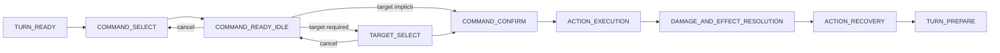
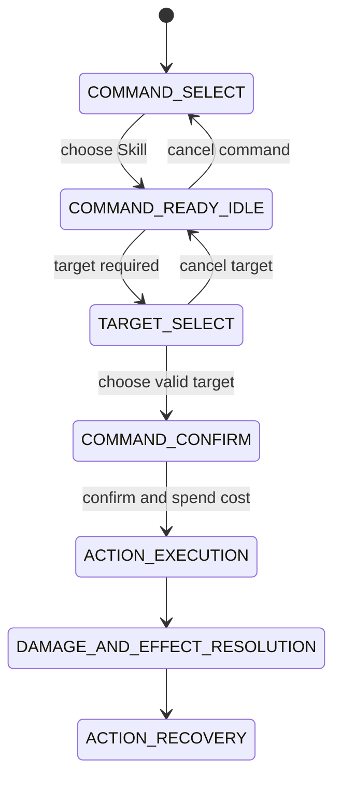
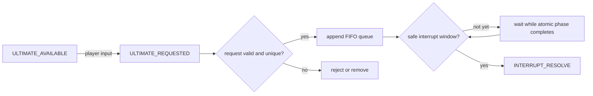
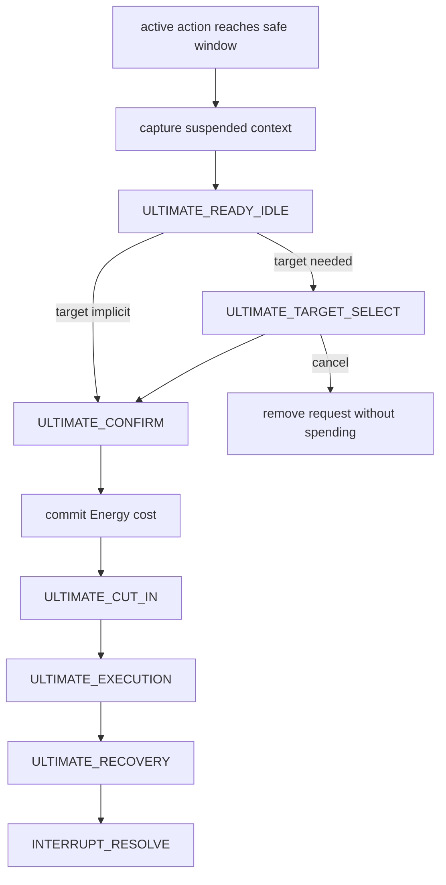
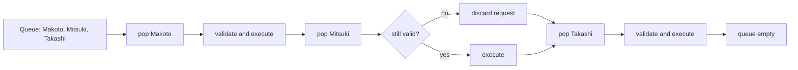
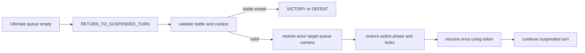

# Destiny Realms Battle System Specification

## Scope

This document defines the target battle contract. Block 5 implements the normal
turn command slice in an isolated debug scene without refactoring
`battle_manager.gd`, altering damage, changing enemy AI, rebalancing turns, or
implementing the Ultimate interrupt queue. Block 6 migrates only production
Basic Attack to that command contract behind a feature flag.

## Block 5 implementation status

Implemented in `scenes/battle/debug/battle_command_flow_debug.tscn`:

- Pending Basic, Skill, and turn-owned Ultimate commands.
- Ready idle, target selection, confirm/cancel, execution, resolution, recovery,
  victory, and defeat states.
- Final actor, target, and resource validation at the commit boundary.
- Single-use commit tokens guarding resource and effect resolution.
- Explicit rejection of off-turn interrupt requests until a later block.
- F6 debug controls for target cycling, Energy fill, and target invalidation.

## Block 6 implementation status

Implemented in production `BattleManager` for Basic Attack only:

- Runtime `BasicAttackCommandAdapter` composes `BattleCommandFlow` without
  rewriting `battle_manager.gd`.
- `use_new_basic_command_flow` enables the new Basic path by default; disabling
  it restores the legacy immediate Basic fallback.
- Pressing Basic creates a pending `BASIC_ATTACK`, enters Takashi Basic ready
  idle, preselects a live enemy target, shows target highlight and production
  confirm/cancel UI, and does not deal damage or grant SP.
- Cancel clears pending command, target highlight, and confirm/cancel UI,
  restores battle idle, keeps player turn ownership, and produces no VFX, SFX,
  damage, SP, Energy, enemy turn, or camera action.
- Confirm validates battle state, actor, live target, active action token, and
  targetability before commit. Basic has no cost, so no resource mutation occurs
  at commit.
- Existing Basic execution remains authoritative for movement, animation, VFX,
  SFX, damage, hit feedback, camera shake, Energy gain, SP reward, recovery,
  victory, enemy turn, return scene, and `WorldProgress`.
- Commit token, command lifecycle flags, and production recovery/turn token
  dictionaries guard duplicate confirm, execution, resolution, recovery, and
  turn completion.
- Lesser Abyss and Bandit Captain production battles are covered. Bandit has
  one live target today; target cycling is ready for future multi-enemy
  production encounters but has no alternate target in current data.
- Skill and Ultimate remain legacy. Selecting them while Basic is pending
  cancels Basic safely first, then continues the legacy command if its existing
  checks pass.

Still not implemented:

- Production Skill command flow.
- Production Ultimate command flow.
- Off-turn Ultimate request, FIFO queue, suspended context, or resume.

See `docs/battle_command_flow_implementation.md` for file ownership, test
commands, screenshots, feature flag, fallback, and known limitations.

## Responsibility model

Four independent state domains are required:

| Domain | Owns | Must not own |
| --- | --- | --- |
| Battle flow | Turn and command phase transitions | Sprite frame timing |
| Character animation | Battle idle, ready idle, action, hit, recovery | Damage or resource mutation |
| UI interaction | Visible controls, focus, target cursor, confirm/cancel, locks | Battle outcome |
| Action resolution | Costs, damage, healing, status, pending effects | Input focus or camera composition |

An animation completion signal may permit a battle transition, but animation
code must not directly decide damage or advance the turn.

## Normal command flow

Basic Attack and Skill use the same commit boundary:



Rules:

- A command button creates a pending action; it does not deal damage.
- Costs are validated while selecting but committed only after confirmation.
- Input is locked during execution, effect resolution, and unsafe recovery.
- Damage and status events run once from a committed action.
- Recovery returns the actor to battle idle before the next turn begins.

## Skill ready idle



`COMMAND_READY_IDLE` owns presentation of the selected Skill pose. The pending
action owns actor, command, candidate target, and quoted cost. Cancel destroys
that pending action, restores normal battle idle, and spends nothing.

## Target selection

- Target rules belong to action data or a target policy, not individual buttons.
- Valid targets are recalculated before confirmation.
- A single valid target may be preselected but still follows the confirmation
  contract unless the command explicitly opts into immediate confirmation.
- Cancel from target selection returns to ready idle.
- If all targets become invalid, return to command selection with no cost.

## Ultimate Energy

- Energy is battle-only and has one battle-owned source of truth per character.
- Gain events are explicit action-resolution events.
- Availability is `current_energy >= ultimate_cost`.
- Pressing Ultimate creates a request or pending action; it does not spend.
- Confirmation atomically validates actor, target, and cost, then deducts.
- Cancel before confirmation does not spend Energy.
- UI observes Energy and availability; it does not calculate or mutate them.
- Victory, defeat, and battle teardown invalidate pending Ultimate requests.

## Off-turn Ultimate request



Allowed input states must be listed explicitly. At minimum, requests may be
accepted during normal player and enemy turn activity, except while input is
locked, an Ultimate is active, battle is ending, or the scene is paused.

## Safe interrupt window

A safe interrupt window exists only between atomic action phases. It is not a
timer and must not be inferred from a visual frame number.

Safe examples:

- Before an action starts.
- After movement/cast setup completes but before the committed hit phase, if the
  action contract marks that boundary resumable.
- After all damage and effects for the current atomic phase have resolved.
- During stable turn preparation or recovery.

Unsafe examples:

- While damage, heal, status, or resource events are being applied.
- During a hit loop that has not committed all of its hits.
- While a camera or animation await is expected to trigger the next effect.
- During an Ultimate cut-in, execution, or recovery.
- During victory/defeat transition.

## Interrupt and Ultimate execution



No Ultimate may interrupt another Ultimate. New valid requests may be appended
while the queue is open only if the active state permits input; they wait until
the current Ultimate recovery completes.

## Multiple Ultimate queue



Queue rules:

- FIFO order.
- At most one pending request per character.
- Queue membership is independent from turn ownership.
- Validate again immediately before ready idle and before commit.
- Dead, disabled, removed, unaffordable, or targetless requests are discarded
  safely.
- A cancelled request may be requested again later if availability remains.

## Suspended battle context

Recommended data contract:

```gdscript
class_name SuspendedBattleContext

var actor_id: StringName
var target_ids: Array[StringName]
var turn_index: int
var battle_state: int
var action_id: StringName
var action_phase: int
var pending_effects: Array
var turn_queue: Array[StringName]
var input_lock: bool
var camera_state: Dictionary
var animation_completion: Dictionary
var active_status_resolution: Dictionary
var resume_token: int
```

The snapshot stores identifiers and deterministic phase data, not live Tween or
Signal objects. `resume_token` guards against duplicate resume. A first
prototype may support only explicitly resumable phase boundaries.

## Resume suspended turn



Resume must never replay an already committed damage/effect event. If the
suspended actor or target is no longer valid, the action resolves through a
documented cancellation/recovery path rather than restarting the turn.

## Official battle states

| State | Responsibility |
| --- | --- |
| `BATTLE_START` | Encounter setup, presentation, and initial validation |
| `TURN_PREPARE` | Choose actor, process start-of-turn effects |
| `TURN_READY` | Stable actor turn before command input |
| `COMMAND_SELECT` | Basic/Skill/Ultimate command navigation |
| `COMMAND_READY_IDLE` | Selected Basic/Skill pose and pending action |
| `TARGET_SELECT` | Validate and choose normal-action target |
| `COMMAND_CONFIRM` | Final validation and atomic cost commit |
| `ACTION_EXECUTION` | Movement, cast, and action animation |
| `DAMAGE_AND_EFFECT_RESOLUTION` | Apply committed damage/status exactly once |
| `ACTION_RECOVERY` | Restore stage, actor idle, and post-action state |
| `ULTIMATE_AVAILABLE` | Availability flag/event, not a blocking phase |
| `ULTIMATE_REQUESTED` | Accepted request awaiting queue processing |
| `ULTIMATE_READY_IDLE` | Ultimate-specific pending pose |
| `ULTIMATE_TARGET_SELECT` | Validate and choose Ultimate target |
| `ULTIMATE_CONFIRM` | Final target/cost validation and Energy commit |
| `ULTIMATE_CUT_IN` | Exclusive cinematic setup; no nested interrupt |
| `ULTIMATE_EXECUTION` | Ultimate animation and committed action |
| `ULTIMATE_RECOVERY` | Restore camera/stage and close active Ultimate |
| `INTERRUPT_RESOLVE` | Validate queue and choose execute-or-resume |
| `RETURN_TO_SUSPENDED_TURN` | Restore one suspended context exactly once |
| `VICTORY` | Lock requests/input and finalize encounter success |
| `DEFEAT` | Lock requests/input and expose retry/exit behavior |
| `PAUSED` | Pause presentation/input without mutating action state |

`ULTIMATE_AVAILABLE` is best represented as availability data or an event
alongside the current flow state. It must not replace the active turn state.

## Victory and defeat

- Check outcome after each committed damage/effect batch.
- If an Ultimate ends battle, clear the remaining request queue.
- Do not restore a suspended turn after outcome is final.
- Victory/defeat owns input lock and scene transition.
- Encounter-specific completion remains delegated to the current stable flow.

## Existing implementation audit

Audited files:

- `scripts/battle/battle_manager.gd` (2,067 lines)
- `scripts/battle/battle_ui.gd` (367 lines)
- `scripts/battle/combatant.gd` (134 lines)
- `scripts/battle/timing_bar.gd` (78 lines)
- `scripts/battle/battle_sfx.gd` (824 lines)
- `scenes/battle/battle_scene.tscn`

Findings:

| Area | Current behavior | Gap against target |
| --- | --- | --- |
| Flow state | Five states: player, resolution, enemy, win, lose | Command, target, recovery, and interrupt phases are collapsed |
| Basic | Button immediately enters resolution and starts movement | No pending command, ready idle, target, cancel, or explicit confirm |
| Skill | Button enters resolution and spends SP before cast feedback | Cost is paid before a confirmation boundary |
| Ultimate | Player-turn only; Energy resets immediately on press | No off-turn request, queue, target, cancel, or safe interrupt |
| Confirm | Confirm during player turn calls Basic Attack | It is a shortcut, not command confirmation |
| Targeting | Player actions use the single `enemy` node directly | No independent target-selection state or policy |
| Energy | `battle_manager.gd::ultimate_energy` is current source | Single-character and manager-local; no per-character model |
| Turn order | Alternates player/enemy and displays static chips | No resumable queue or turn context snapshot |
| Idle | Battle idle plus Basic/Skill/Ultimate frame sets exist | Command-specific frames immediately accompany execution |
| Timing bar | Standalone API exists but is not connected to manager flow | Dormant system; do not build interrupt on it |
| Encounter flow | One scene configures Lesser Abyss or Bandit Captain | Stable and must remain unchanged in Block 4 |
| UI | HP, Energy, SP, turn chips, and three command buttons exist | UI and flow are tightly coupled to manager signals |
| Sequencing | Await chains guard `ACTION_RESOLUTION` repeatedly | Mid-chain suspension risks skipped or duplicated effects |
| Structure | Manager mixes encounter config, flow, assets, VFX, camera, audio | Monolithic; interrupt additions would increase coupling |

The Lesser Abyss default routes victory to Ending and retry to Prologue. The
Bandit Captain variant reads `WorldProgress.active_battle_id`, swaps enemy,
background and BGM, completes the encounter on victory, and returns to
Grasslands. These flows were audited but not modified.

## Main risks

1. Resuming an await chain after mutation can duplicate damage or skip recovery.
2. Immediate resource mutation conflicts with cancel and request validation.
3. A single integer state cannot describe flow, animation, UI, and resolution.
4. Direct actor/enemy references prevent party and multi-target expansion.
5. Camera/UI restoration is currently embedded in Ultimate execution.
6. Async callbacks can survive a state change unless guarded by action tokens.
7. Static turn chips do not represent an authoritative queue.

## Recommended implementation phases

1. Add characterization tests around existing Basic, Skill, Ultimate, Lesser
   Abyss, and Bandit Captain behavior.
2. Introduce data-only `BattleAction`, `ActionPhase`, and per-character battle
   resource models without changing results.
3. Add a small flow controller for command select, ready idle, target, confirm,
   cancel, execution, resolution, and recovery.
4. Move current visual sequences behind action-executor interfaces while
   retaining their timing and damage values.
5. Introduce authoritative turn queue and resumable action tokens.
6. Prototype one off-turn Ultimate at explicit safe boundaries.
7. Add FIFO, duplicate prevention, invalidation, and multi-Ultimate tests.
8. Integrate battle UI availability and target feedback only after the state
   contract is stable.

Recommended extraction boundaries are `BattleFlowController`,
`BattleActionResolver`, `BattleTurnQueue`, `UltimateRequestQueue`,
`BattlePresentationController`, and `EncounterConfig`. Existing VFX/audio
functions can remain behind the presentation controller until later.
