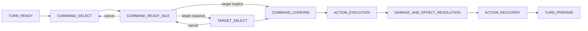
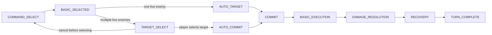
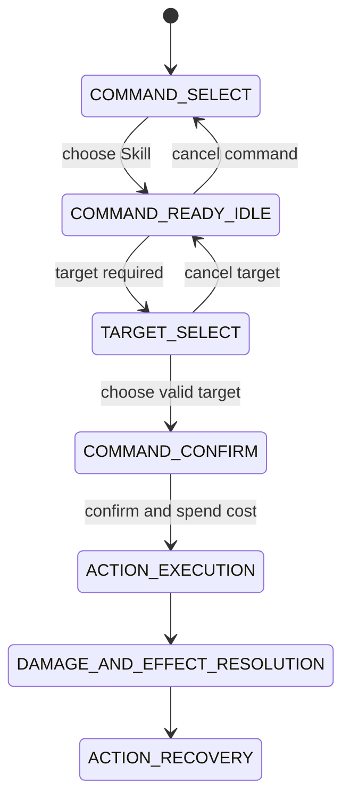
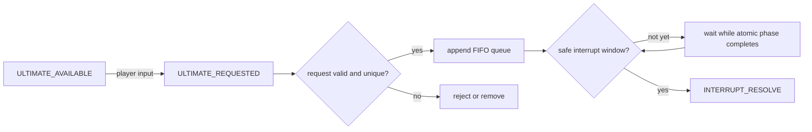
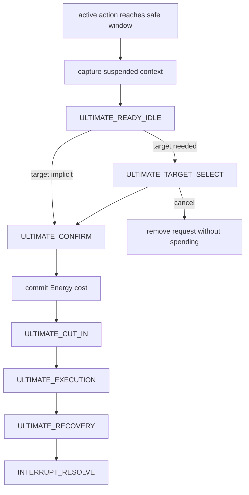
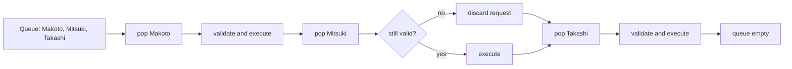
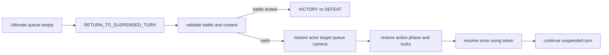

# Destiny Realms Battle System Specification

## Scope

This document defines the target battle contract. Block 5 implements the normal
turn command slice in an isolated debug scene without refactoring
`battle_manager.gd`, altering damage, changing enemy AI, rebalancing turns, or
implementing the Ultimate interrupt queue. Block 6 migrates only production
Basic Attack to that command contract behind a feature flag. Block 7 migrates
production Skill to the same contract behind its own feature flag while keeping
Ultimate legacy. Block 8 migrates production on-turn Ultimate to the same
command contract behind its own feature flag. Block 8.5 revises production
Basic Attack to a fast command with no ready idle and no confirm/cancel step,
while Skill and Ultimate keep their ready idle and confirm/cancel steps. Off-
turn Ultimate interrupt, the FIFO queue, and suspended battle context remain
unimplemented.

## Block 5 implementation status

Implemented in `scenes/battle/debug/battle_command_flow_debug.tscn`:

- Pending Basic, Skill, and turn-owned Ultimate commands.
- Ready idle, target selection, confirm/cancel, execution, resolution, recovery,
  victory, and defeat states.
- Final actor, target, and resource validation at the commit boundary.
- Single-use commit tokens guarding resource and effect resolution.
- Explicit rejection of off-turn interrupt requests until a later block.
- F6 debug controls for target cycling, Energy fill, and target invalidation.

## Block 6 implementation status

> Superseded by Block 8.5 for Basic Attack's player-facing UX: Basic no
> longer has a ready idle or confirm/cancel step. The pending-command
> architecture, adapter, feature flag, and legacy fallback described below
> are still accurate; only the ready-idle/confirm-panel behavior changed.
> See "Block 8.5 implementation status" below for the current flow.

Implemented in production `BattleManager` for Basic Attack only:

- Runtime `BasicAttackCommandAdapter` composes `BattleCommandFlow` without
  rewriting `battle_manager.gd`.
- `use_new_basic_command_flow` enables the new Basic path by default; disabling
  it restores the legacy immediate Basic fallback.
- Pressing Basic creates a pending `BASIC_ATTACK`, enters Takashi Basic ready
  idle, preselects a live enemy target, shows target highlight and production
  confirm/cancel UI, and does not deal damage or grant SP.
- Cancel clears pending command, target highlight, and confirm/cancel UI,
  restores battle idle, keeps player turn ownership, and produces no VFX, SFX,
  damage, SP, Energy, enemy turn, or camera action.
- Confirm validates battle state, actor, live target, active action token, and
  targetability before commit. Basic has no cost, so no resource mutation occurs
  at commit.
- Existing Basic execution remains authoritative for movement, animation, VFX,
  SFX, damage, hit feedback, camera shake, Energy gain, SP reward, recovery,
  victory, enemy turn, return scene, and `WorldProgress`.
- Commit token, command lifecycle flags, and production recovery/turn token
  dictionaries guard duplicate confirm, execution, resolution, recovery, and
  turn completion.
- Lesser Abyss and Bandit Captain production battles are covered. Bandit has
  one live target today; target cycling is ready for future multi-enemy
  production encounters but has no alternate target in current data.
- Skill and Ultimate remain legacy. Selecting them while Basic is pending
  cancels Basic safely first, then continues the legacy command if its existing
  checks pass.

## Block 7 implementation status

Implemented in production `BattleManager` for Skill only:

- Runtime `SkillCommandAdapter` composes `BattleCommandFlow` without rewriting
  `battle_manager.gd`.
- `use_new_skill_command_flow` enables the new Skill path by default; disabling
  it restores the legacy immediate Skill fallback.
- Pressing Skill creates a pending `SKILL` command for `triangle_rift`, enters
  Takashi Skill ready idle using existing Skill frames, preselects a live enemy
  target, shows Skill target highlight and production confirm/cancel UI, and
  does not spend SP, deal damage, play impact VFX/SFX, move Takashi, progress
  the turn, or trigger enemy AI.
- Cancel clears pending Skill, target highlight, and confirm/cancel UI,
  restores battle idle, keeps player turn ownership, and produces no damage,
  status, resource mutation, camera action, or turn progression.
- Confirm validates battle state, actor, live target, active Basic/Skill token,
  targetability, action id, and current SP before commit.
- Commit spends `SKILL_POINT_COST_SKILL` exactly once. Select, ready idle,
  target selection, cancel, and failed pre-commit validation spend nothing.
- Existing Triangle Rift execution remains authoritative for cast feedback,
  movement, projectile, VFX, SFX, one `SKILL_DAMAGE` hit, hit feedback, camera
  shake, `SKILL_ENERGY` gain, recovery, victory, enemy turn, return scene, and
  `WorldProgress`.
- Triangle Rift is currently characterized as a single-target, single-hit Skill
  with no status effect. The new path records hit index `0` per command token
  so duplicate callbacks cannot resolve the same hit twice.
- Basic and Skill use separate feature flags, adapters, active tokens, panels,
  and target highlights. Selecting either command while the other is pending
  cancels the old pending command first, then starts the new one.
- Ultimate remains legacy. Selecting Ultimate while Skill is pending cancels
  Skill first, then runs the existing Ultimate path if Energy is full. Ultimate
  Energy timing is unchanged.

Still not implemented:

- Production Ultimate command flow.
- Off-turn Ultimate request, FIFO queue, suspended context, or resume.

See `docs/battle_command_flow_implementation.md` for file ownership, test
commands, screenshots, feature flag, fallback, and known limitations.

## Block 8 implementation status

Implemented in production `BattleManager` for on-turn Ultimate only:

- Runtime `UltimateCommandAdapter` composes its own `BattleCommandFlow`
  instance without rewriting `battle_manager.gd`, mirroring the Basic and
  Skill adapters.
- `use_new_ultimate_command_flow` enables the new Ultimate path by default;
  disabling it restores the legacy immediate Ultimate fallback, including the
  old timing where Energy is zeroed the instant the button is pressed.
- Pressing Ultimate creates a pending `ULTIMATE` command for
  `octagram_fragment` with `SINGLE_ENEMY` targeting and an Energy cost of
  `MAX_ULTIMATE_ENERGY`, shows the existing Ultimate pose (`UltiTaka.png`) as a
  ready idle, preselects a live enemy target, shows Ultimate target highlight
  and production confirm/cancel UI, and does not spend Energy, start the
  cut-in, run camera cinematics, deal damage, or progress the turn.
- Cancel clears pending Ultimate, target highlight, and confirm/cancel UI,
  restores battle idle, keeps player turn ownership, and produces no cut-in,
  camera change, damage, status, resource mutation, or turn progression.
- Confirm validates battle state, actor, live target, active
  Basic/Skill/Ultimate token, targetability, action id, and current Energy
  before commit.
- Commit spends `MAX_ULTIMATE_ENERGY` Energy exactly once, fixing the legacy
  bug where Energy was zeroed synchronously on button press before any
  cut-in, camera, or animation had started. Select, ready idle, target
  selection, cancel, and failed pre-commit validation spend nothing.
- Existing Octagram Fragment execution remains authoritative for cut-in
  frame playback, camera zoom/shake, Takashi pre/post animation, VFX, SFX,
  one `ULTIMATE_DAMAGE` hit, hit feedback, recovery, victory, enemy turn,
  return scene, and `WorldProgress`. The shared execution function now takes
  an optional command so the same legacy sequence serves both the legacy
  fallback (`command == null`) and the new pending-command path.
- `PendingBattleCommand.RequestSource.INTERRUPT_REQUEST` is rejected by the
  shared `BattleCommandFlow.begin_command()` with
  `off_turn_interrupt_not_available` for all three command types, including
  Ultimate. No FIFO queue or suspended battle context is implemented; the
  adapter accepts a `request_source` parameter so Block 9 can add an
  off-turn caller without changing the command model.
- Octagram Fragment is currently characterized as a single-target,
  single-hit Ultimate with no status effect. The new path records hit index
  `0` per command token so duplicate callbacks cannot resolve the same hit
  twice.
- Basic, Skill, and Ultimate each use separate feature flags, adapters,
  active tokens, panels, and target highlights. Selecting any command while
  another is pending cancels the old pending command first, then starts the
  new one.

Still not implemented:

- Off-turn Ultimate request, FIFO queue, suspended context, or resume.

See `docs/battle_command_flow_implementation.md` for file ownership, test
commands, screenshots, feature flag, fallback, and known limitations.

## Block 8.5 implementation status

Revises production Basic Attack to a fast command. Skill and Ultimate are
unchanged: both still use ready idle, target selection, confirm/cancel,
commit, and (for Ultimate) cut-in.

`BattleCommandFlow.begin_command()` gained three optional parameters —
`requires_ready_idle`, `requires_confirm`, and `auto_commit_on_target_selected`
(all default `true`/`true`/`false`, preserving prior behavior for any caller
that does not pass them) — stored on the `PendingBattleCommand` instance
itself so the rest of the flow controller can read a single command's own
pacing rules instead of branching on command type. `BasicAttackCommandAdapter`
is the only caller that opts in to `requires_ready_idle = false`,
`requires_confirm = false`, `auto_commit_on_target_selected = true`; Skill and
Ultimate adapters pass no extra arguments and keep the original ready
idle/confirm contract.

New Basic Attack flow:

- One live enemy: `COMMAND_SELECT -> BASIC_SELECTED -> AUTO_TARGET -> COMMIT -> BASIC_EXECUTION -> DAMAGE_RESOLUTION -> RECOVERY -> TURN_COMPLETE`.
- Multiple live enemies: `COMMAND_SELECT -> BASIC_SELECTED -> TARGET_SELECT -> PLAYER_SELECT_TARGET -> AUTO_COMMIT -> BASIC_EXECUTION -> DAMAGE_RESOLUTION -> RECOVERY -> TURN_COMPLETE`.

Behavior:

- Pressing Basic with one live enemy target auto-selects it and commits in
  the same call, with no ready idle, no confirm panel, and no wait — the
  attack is already executing by the time the button-press handler returns.
- Pressing Basic with two or more live enemies enters target selection (no
  ready idle) and shows a target highlight; selecting a target — by click,
  keyboard cycle, or the shared confirm/interact key — commits immediately
  with no separate confirm panel.
- Cancel is only available before a target is chosen (multi-enemy target
  selection). A committed Basic command — which for a single live enemy
  happens instantly — cannot be cancelled or replaced.
- Command switching is unchanged in rule (selecting any command while another
  is pending cancels the old pending command first) but Basic's pending
  window is usually too short to observe with a single live enemy; the
  window is only meaningfully observable during multi-enemy target
  selection.
- Commit boundary, resource validation (actor/target liveness, battle state,
  token, no concurrent execution), duplicate-commit/execution/resolution/
  recovery/turn-completion guards, damage formula, and SP gain timing (after
  hit resolves, exactly once) are all unchanged from Block 6/8.
- Existing Basic execution remains authoritative for movement, animation,
  VFX, SFX, damage, hit feedback, camera shake, Energy gain, SP reward,
  recovery, victory, enemy turn, return scene, and `WorldProgress`.
- `use_new_basic_command_flow = false` still restores the pre-Block-6 legacy
  immediate Basic fallback, unchanged.

Removed from `battle_manager.gd`: the Basic ready-idle texture switch
(`_start_basic_ready_idle`), the Basic confirm/cancel panel and its
construction/style/visibility/update functions, and their four associated
`Control` node variables. `basic_target_highlight` and the Basic target
cycle/click selection helpers are unchanged and now double as the multi-enemy
target-selection UI.

Still not implemented:

- Off-turn Ultimate request, FIFO queue, suspended context, or resume.
- A production encounter with two or more live enemies (Basic's multi-target
  path is covered by adapter-level logic and a test-only mock second enemy,
  not by live encounter data).

See `docs/battle_command_flow_implementation.md` for file ownership, test
commands, screenshots, feature flag, fallback, and known limitations.

## Block 9A implementation status

Ultimate off-turn interrupt **architecture and characterization only**.
Off-turn Ultimate is still not executable in production after this block.
`begin_command()` still rejects `RequestSource.INTERRUPT_REQUEST`
unconditionally, exactly as it has since Block 5. Basic, Skill, and Ultimate
on-turn are unchanged.

This section is the authoritative record of the Block 9A design. The older
"Off-turn Ultimate request", "Safe interrupt window", "Interrupt and
Ultimate execution", "Multiple Ultimate queue", "Suspended battle context",
and "Resume suspended turn" sections below predate this block (Block 5) and
are kept as the original conceptual sketch; where this section's field
names or rules differ, this section wins.

### Final design intent

Ultimate may be **requested** off-turn when: Energy is sufficient, the
character is alive, the Ultimate action is available, the battle has not
reached victory/defeat, no other Ultimate is currently active, the current
state accepts requests, and the requesting actor has no other pending
interrupt request. A request never runs immediately — it is appended to a
FIFO queue and does nothing else.

When the battle reaches a safe interrupt window, the queue is drained one
request at a time:
1. Revalidate the request (actor, Energy, battle state).
2. Suspend the current battle context at that safe point.
3. Run the queued Ultimate through the **same** on-turn flow already built in
   Block 8: `ULTIMATE_READY_IDLE -> TARGET_SELECT -> CONFIRM/CANCEL ->
   ENERGY_REVALIDATION -> COMMIT/SPEND_ENERGY -> ULTIMATE_CUT_IN ->
   ULTIMATE_EXECUTION -> DAMAGE_AND_EFFECT_RESOLUTION -> ULTIMATE_RECOVERY`.
4. Process the next queued request if one exists, otherwise resume the
   suspended context from its exact safe point.

Hard rules (unchanged by any future block without a fresh review):
- An Ultimate may never interrupt another Ultimate.
- An interrupt may never begin while a commit/damage resolution is already
  in flight for any command.
- Damage, turn completion, and victory/defeat resolution each still happen
  exactly once per command, the same guarantee Basic/Skill/Ultimate on-turn
  already have via commit tokens.
- An already-committed enemy action is never discarded or replayed.
- Turn order is never reordered by an interrupt; only *paused and resumed*.
- Energy is deducted **only** at Ultimate commit — never at request time,
  never while queued, never entering ready idle, never on cancel. This is
  the same rule Block 8 already enforces for on-turn Ultimate; off-turn must
  not weaken it.

### Current battle characterization (Block 9A audit)

**Player turn.** `state == PLAYER_TURN` is entered by `_begin_player_turn()`
(`battle_manager.gd`). Basic, Skill, and Ultimate each go through their own
`BattleCommandFlow` instance via their adapter (Block 6/7/8). Command
switching already guarantees at most one pending command and at most one
committed command across all three at any time (existing guards in
`_on_attack_pressed`/`_on_skill_pressed`/`_on_ultimate_pressed`, unchanged by
this block).

**Enemy turn — no commit token, no guard chain.** This is the most important
finding of this audit. Unlike Basic/Skill/Ultimate, the enemy attack is
*not* modeled through `PendingBattleCommand`/`BattleCommandFlow` at all; it
is a single ad hoc coroutine with almost none of the token/guard
infrastructure the player commands have:
- `_begin_enemy_turn()` sets `state = ENEMY_TURN`, disables input, and
  `await`s `TURN_DELAY_SECONDS` (0.6s). This wait is checked once
  (`if state == ENEMY_TURN: _enemy_attack()`) — this is the only place in
  the entire enemy turn where a state change is checked before proceeding.
- `_enemy_attack()` computes damage and log text up front (no commit
  boundary), then `await`s `enemy.play_attack_movement(player)`, with
  exactly one guard check after that single await
  (`if state != ENEMY_TURN: return`).
- Everything after that guard — SFX, VFX, `player.take_damage(damage)`,
  floating damage, `await player.play_hit_feedback()`, `_shake_camera()`,
  the `player.is_defeated()` check, and the call into `_lose()` or
  `_begin_player_turn()` — runs with **zero** further guard checks, including
  after the `play_hit_feedback()` await. Basic/Skill/Ultimate all re-check a
  guard after every `await`; the enemy turn does not.
- Practical consequence for Block 9B+: the entire enemy attack, from the
  start of `play_attack_movement` through `_begin_player_turn()`/`_lose()`
  returning, must be treated as **one unsafe window**. There is no
  sub-window inside it a future interrupt could safely target without first
  adding the same guard discipline Basic/Skill/Ultimate already have — that
  guard work is out of scope for Block 9A (it would change enemy-turn
  behavior, which is forbidden this block) and is called out as a Block 9B
  prerequisite below.

**Ultimate on-turn cut-in chain.** `_run_ultimate_sequence()`
(`scripts/battle/battle_manager.gd`) is ~88 lines and 11 guard checkpoints
(`_ultimate_execution_guard()`), covering: camera zoom-in, FVX intro, pre
animation, the 88-frame full-screen cut-in, shatter/SFX, post animation,
camera zoom-out, player feedback, player movement, enemy impact VFX, damage,
hit feedback, glow fade-out, impact camera zoom-out. Every `await` boundary
is followed by a guard re-check exactly as Block 8 documented. This entire
function, start to finish, is an unsafe window — see below.

**Victory/defeat.** `_win()`/`_lose()` already zero all three active command
tokens and call `lock_for_outcome()` on all three adapters unconditionally.
This means Block 9B's suspended-context discard-on-victory/defeat rule has
an existing hook to attach to: any live `SuspendedBattleContext` at the
moment `_win()`/`_lose()` runs must be discarded there, since these
functions already assume nothing else is still commit-active afterward.

**Resource leak note.** Every test run in this session (Basic, Skill,
Ultimate, debug scene, Bandit startup) prints `WARNING: 2 ObjectDB instances
were leaked at exit` / `ERROR: 1 resources still in use at exit` at
`get_tree().quit()`. This is a pre-existing condition already documented in
the Block 8 verification notes, reproduces identically with zero Block 9A
code loaded, and is unrelated to interrupt work. Not investigated further
per this block's scope (no behavior changes).

### Safe interrupt windows

| Window | Where in current code | Verdict |
| --- | --- | --- |
| A. Before enemy action commit | The `await get_tree().create_timer(TURN_DELAY_SECONDS).timeout` inside `_begin_enemy_turn()`, before `_enemy_attack()` is called | Safe in principle, but there is no hook today to redirect from this await into interrupt processing — adding one is Block 9B work, not Block 9A |
| B. After enemy action recovery, before next turn | The instant between `_enemy_attack()` calling `_begin_player_turn()`/`_lose()` and that function returning, before any input is processed | Safe — matches `COMMAND_SELECT`-equivalent state with no pending/committed command on any of the three adapters |
| C. Player `COMMAND_SELECT`, no pending command | `state == PLAYER_TURN` and `_has_pending_basic_command() == false` and `_has_pending_skill_command() == false` and `_has_pending_ultimate_command() == false` | Safe — this is the same condition `begin_command()` already requires (`battle_state == COMMAND_SELECT`) |

Unsafe windows (current code, confirmed by this audit):
- Any point inside `_enemy_attack()`'s await chain (movement through
  `_begin_player_turn()`/`_lose()` return) — see characterization above.
- Any point inside `_run_ultimate_sequence()` (cut-in, execution, recovery).
- Any point between a Basic/Skill/Ultimate command's `commit_pending_command()`
  returning `true` and its `complete_recovery()` returning `true` — i.e.
  while `active_basic_command_token`/`active_skill_command_token`/
  `active_ultimate_command_token` is non-zero.
- During `_win()`/`_lose()` and the following scene-transition await.
- During scene exit/teardown (`_exit_tree()`).

For Block 9A, `BattleCommandFlow.can_process_interrupt_now()` exists as a
named stub (always returns `false`) rather than a real implementation,
because the real answer needs `BattleManager`-level state (whose turn it is,
whether the enemy await chain is mid-flight) that `BattleCommandFlow` — a
per-command, not per-battle, controller — does not have. See "BattleCommandFlow
impact" below.

### Suspended battle context

Implemented as a skeleton class,
`scripts/battle/command/suspended_battle_context.gd`
(`class_name SuspendedBattleContext`, `extends RefCounted`). Field names
differ slightly from the original Block 5 sketch further down this document
to match what a safe window in *this* codebase actually needs to capture:

| Field | Notes |
| --- | --- |
| `suspended_state` | Snapshot of `BattleManager.state` at suspension |
| `current_turn_owner` | `&"player"` or `&"enemy"` |
| `current_actor`, `current_target` | Node references at suspension |
| `current_action_id`, `current_action_phase` | Identifies what was interrupted |
| `current_commit_token`, `current_turn_token` | For duplicate-resume detection |
| `pending_effect_status` | Renamed from the original sketch's `pending_effects: Array`; a status tag, not a live effect list, since live effects must never be replayed |
| `active_ui_state`, `input_lock_state`, `target_highlight_state` | UI restoration data |
| `camera_state` | Renamed from the original sketch's untyped dictionary; still a `Dictionary` (deliberately not live `Tween`/`Camera2D` references) |
| `enemy_action_context` | Only populated if interrupt occurs mid-enemy-turn |
| `resume_policy`, `resume_token` | `resume_token` is single-use, enforced by `mark_resumed()` |

Behavior implemented and unit-testable today: `mark_resumed()` returns
`true` exactly once and `false` on every call after (including after
`discard()`); `discard()` is permanent; `can_resume()` reflects both flags.
**Not implemented:** nothing constructs, populates, or resumes a
`SuspendedBattleContext` from live battle state yet — that requires
`BattleManager` integration, which is Block 9B+.

### Interrupt request and queue model

Implemented as two skeleton classes:

- `scripts/battle/command/ultimate_interrupt_request.gd`
  (`class_name UltimateInterruptRequest`, `extends RefCounted`) — plain data
  holder: `unique_request_id`, `actor`, `actor_id`, `action_id`,
  `request_source` (defaults to `RequestSource.INTERRUPT_REQUEST`),
  `energy_cost`, `requested_at_state`, `requested_at_turn`, `request_order`,
  `preferred_target`, `validation_status`
  (`PENDING`/`ACCEPTED`/`REJECTED`/`EXPIRED`), `reject_reason`,
  `created_at_msec`. Constructing one has no side effects on Energy, HP, or
  turn state.
- `scripts/battle/command/ultimate_interrupt_queue.gd`
  (`class_name UltimateInterruptQueue`, `extends RefCounted`) — pure FIFO
  queue. `configure(energy_lookup, battle_over_lookup,
  ultimate_active_lookup)` takes three `Callable`s so the queue never reads
  `BattleManager` directly, mirroring how `BattleCommandFlow` takes resource
  callbacks via `configure_resource_callbacks()` instead of reaching into
  `BattleManager`. `request_ultimate()` validates and either enqueues or
  rejects synchronously; `peek_next()`/`dequeue_next()` preserve FIFO order;
  `cancel_request_for(actor)` removes a still-queued request;
  `revalidate(request)` is the process-time recheck hook for Block 9B.

**Not wired to production**: nothing in `battle_manager.gd` creates a
`UltimateInterruptQueue` instance. The class is exercised only by
`tests/battle/test_ultimate_interrupt_queue.gd`.

### Validation layers

**Request-time** (`UltimateInterruptQueue.request_ultimate()`, implemented):
actor valid and alive, not a duplicate for that actor, battle not already
over, no Ultimate currently active, Energy sufficient for the quoted cost.
Rejection never enqueues and never touches Energy.

**Process-time** (`UltimateInterruptQueue.revalidate()`, implemented as a
callable hook, not called by anything yet): the same checks re-run
immediately before a dequeued request would be acted on, since time has
passed since the original request (actor may have died, Energy may have
changed, another Ultimate may have started). A future caller is expected to
treat a non-empty reason as "drop and continue to the next queued request,"
mirroring how a dead/invalid target already cancels a Basic/Skill/Ultimate
command safely today.

**Commit-time** (already implemented in Block 8, unchanged): identical to
on-turn Ultimate — `commit_pending_command()`'s existing validation
(actor/target/resources), single commit token, Energy deducted exactly
once. Block 9B's job is only to route a validated off-turn request into this
existing path, not to build a second commit boundary.

### BattleCommandFlow impact

Three additive stub methods were added to
`scripts/battle/command/battle_command_flow.gd`, each documented inline as
always returning `false` in Block 9A and calling out why:
`can_process_interrupt_now()`, `queue_ultimate_interrupt(request)`,
`begin_interrupt_request(actor, action_id, target_rule, candidate_targets,
energy_cost)`. None of them are called by any other method in the file or
by any production code. `begin_command()` is unmodified and still contains
the original unconditional `if request_source ==
RequestSource.INTERRUPT_REQUEST: _fail(...); return false` check as its
first line.

No enum values were added to `BattleFlowState`/`CharacterAnimationState`/
`UiInteractionState`. This was a deliberate choice, not an oversight:
`BattleCommandFlow` models one pending command for one actor, while
"suspended battle" is a battle-wide concept spanning whichever command was
active plus the enemy turn, which this controller has no representation of.
Adding a `SUSPENDED` value to `BattleFlowState` would conflate two different
scopes. That state, if needed, belongs on `SuspendedBattleContext` or
`BattleManager`, decided in Block 9B once the real integration shape is
known.

### UI readiness spec (design only, no production UI added)

For Block 9B/9C, the following UI affordances are anticipated but **not**
implemented in Block 9A:
- An "Ultimate Ready" indicator whenever Energy is full, even off-turn
  (distinct from the existing on-turn action button state).
- An off-turn request input (button or shortcut) that only appears when the
  request-time validation above would pass.
- A small "Ultimate queued" toast/indicator while a request is accepted but
  not yet processed.
- "Cannot interrupt now" feedback when a request is rejected (reusing the
  existing `_basic_command_failure_message`/`_skill_command_failure_message`/
  `_ultimate_command_failure_message` pattern already established per
  command type).
- When the safe window is reached and the queued request is dequeued, the
  UX is identical to on-turn Ultimate: ready idle, target selection,
  confirm/cancel, cut-in — no new screens.

No Skill/Ultimate panel, no Basic UI, and no shared battle UI were touched
in Block 9A.

### Test plan and Block 9 status

Implemented now: `tests/battle/test_ultimate_interrupt_queue.gd` (+
`.tscn`), a pure contract test against `UltimateInterruptQueue` in
isolation (no `BattleManager`, no scene). Covers: valid request enqueues,
duplicate actor rejected, insufficient Energy rejected, dead actor
rejected, battle-already-over rejected, Ultimate-already-active rejected,
FIFO order, Energy never spent by enqueue, cancel clears the queue,
`revalidate()` catches a request that went stale after enqueue.

Deferred to Block 9B+ (not built in Block 9A): any test that exercises
`BattleManager` actually creating a queue, suspending context, or draining
requests into the existing Ultimate commit path — because none of that
exists yet.

### Known risks carried into Block 9B

1. Enemy turn has no guard-chain discipline at all (see characterization
   above); Block 9B likely needs to add guard checks to `_enemy_attack()`
   itself before any interrupt window inside it can be considered, and that
   is a change to enemy-turn code that must be scoped and reviewed
   separately from "wire the queue up."
2. `_run_ultimate_sequence()`'s 11-checkpoint guard chain was designed
   around a single command's own token, not around "was a *different*
   actor's off-turn Ultimate spliced in here" — Block 9B needs to decide
   whether the suspended-context resume path re-enters this same function
   or a variant of it.
3. Camera state (`battle_camera.position`/`zoom`/`offset`) is currently
   restored by direct tween calls scattered through
   `_run_ultimate_sequence()`, not captured as data anywhere. A
   `SuspendedBattleContext.camera_state` snapshot/restore pair needs a real
   implementation before resume can be trusted.
4. `MAX_ULTIMATE_ENERGY`/`ULTIMATE_DAMAGE` and all other balance constants
   are unaffected by this block, but multi-actor off-turn Ultimate implies
   more than one character can reach full Energy independently — this
   block does not audit whether `ultimate_energy` is actor-scoped or
   `BattleManager`-scoped in the current code (it is currently a single
   `BattleManager`-level variable; only Takashi has an Ultimate today, so
   this has not mattered yet, but Block 9B must confirm before a second
   Ultimate-capable actor is added).

## Block 9B implementation status

Off-turn Ultimate is now **executable in production, safe window B only**.
A player may request Ultimate during `ENEMY_TURN`; the request is queued
with zero side effects; it is processed exactly once, immediately after the
enemy's action/recovery fully completes and before `_begin_player_turn()`
would otherwise run. Window A (mid-enemy-action interrupt) and window C
(explicit off-turn request while already in `COMMAND_SELECT`, which is
really just on-turn Ultimate) remain out of scope. This section is
authoritative where it differs from the Block 9A section above; the Block
9A section remains the historical record of the architecture decision.

### What changed vs. Block 9A

`UltimateInterruptQueue` and `UltimateInterruptRequest` (both Block 9A
skeletons) are used as-is, unmodified. `SuspendedBattleContext` is **not**
used — Block 9B does not suspend/resume anything, because safe window B sits
between two turns, not inside one; there is nothing mid-flight to capture.
`BattleCommandFlow.begin_command()` gained one additive parameter,
`interrupt_authorized: bool = false` (14th positional param, default
preserves the exact Block 5–9A behavior for every existing caller):

```gdscript
if (
    request_source == PendingBattleCommand.RequestSource.INTERRUPT_REQUEST
    and not interrupt_authorized
):
    _fail(null, &"off_turn_interrupt_not_available")
    return false
```

Only `BattleManager`'s new queued-Ultimate path passes `true`. The Block 9A
stub methods (`can_process_interrupt_now()`, `queue_ultimate_interrupt()`,
`begin_interrupt_request()`) are untouched and still always return `false` —
Block 9B does not call them, since routing happens directly through
`begin_command()`'s new parameter instead.

### Queue integration (BattleManager)

`battle_manager.gd` owns one `UltimateInterruptQueue` instance
(`ultimate_interrupt_queue`), created in `_setup_ultimate_interrupt_queue()`
(called from `_ready()`) and configured with three lookups exactly as the
Block 9A design specified: Energy (`_interrupt_energy_lookup`, currently
returns the single `BattleManager`-level `ultimate_energy` — see limitations
below), battle-over (`_is_battle_over`), and Ultimate-active-or-processing
(`_is_ultimate_active_or_processing`, true when either
`active_ultimate_command_token != 0` or `is_processing_interrupt_queue` is
true). The queue is reset (cleared, flags zeroed) on every path that already
resets battle state: `_reset_ultimate_command_runtime()` (battle
start/restart), `_win()`, `_lose()`, and `_exit_tree()` (scene exit). No new
reset path was invented; the queue rides along on existing hooks.

### Off-turn request lifecycle

`request_off_turn_ultimate(actor)` is the single entry point. It is called
from `_on_ultimate_pressed()` whenever `state != BattleState.PLAYER_TURN`
(the pre-existing on-turn branch is otherwise unchanged — the on-turn check
now simply runs first). Request-time validation is entirely delegated to
`UltimateInterruptQueue.request_ultimate()` (Block 9A logic, unmodified):
actor alive, not a duplicate for that actor, battle not over, no Ultimate
already active/processing, Energy sufficient. On accept, the request is
appended to the FIFO queue and a `battle_log` line ("Octagram Fragment
queued.") is shown — nothing else happens: no state change, no UI lock, no
Energy deduction, no target selection. On reject,
`_interrupt_request_failure_message(reason)` maps the reason to one of
"Ultimate already queued.", "Not enough Energy.", or "Cannot use Ultimate
now.", shown the same way `_basic_command_failure_message`/
`_skill_command_failure_message`/`_ultimate_command_failure_message` already
report on-turn failures.

The Ultimate button itself stays independently clickable during enemy turn
via one additive parameter on the shared UI helper,
`battle_ui.gd::set_actions_enabled(enabled, ultimate_ready, skill_ready,
ultimate_interactable_override = false)`. `_update_action_buttons()` passes
`_can_request_off_turn_ultimate_input()` as that fourth argument — true only
when `state == ENEMY_TURN`, the new flow is active, the queue is not
currently processing, no Ultimate command is active, and no Ultimate
command is already pending. Basic and Skill buttons are unaffected; they
still use only the first three parameters exactly as before Block 9B.

### Safe window B and process-time validation

The hook lives at the exact point the Block 9A audit identified as window
B: the tail of `_enemy_attack()`, previously `_begin_player_turn(log_text)`
directly, now `await _resume_after_enemy_action(log_text)`. Every line of
`_enemy_attack()` above that tail call (movement, damage, hit feedback,
`is_defeated()` check, the `_lose()` branch) is byte-for-byte unchanged —
Block 9B does not add guard checks inside the enemy attack coroutine, since
the hook only replaces what already ran *after* the enemy turn was fully
resolved.

`_resume_after_enemy_action(log_text)` re-checks `_is_battle_over()`/scene
validity (covers the `_lose()` case — a defeated player never reaches the
queue), then calls `_process_interrupt_queue_at_safe_window(&"after_enemy_recovery")`.
That function performs the Block 9A-specified process-time validation
(actor still alive, Energy still sufficient, no Ultimate now active,
battle not over) by dequeuing with `revalidate()` in a loop, discarding any
now-stale request and trying the next one, until either a valid request is
found or the queue empties. At most **one** request is processed per safe
window — a second queued request (if any) waits for the *next* safe window
B, i.e. after the following enemy turn, not immediately. If no request is
valid or the queue is empty, `_resume_after_enemy_action` falls through to
the original `_begin_player_turn(log_text)` call, so normal play is
byte-identical to pre-Block-9B whenever nothing is queued.

### Queued Ultimate execution path (reuse, not rebuild)

`_begin_queued_ultimate(request)` sets `state = BattleState.PLAYER_TURN`
*before* calling `ultimate_command_adapter.begin_ultimate(&"octagram_fragment",
SINGLE_ENEMY, request.energy_cost, 0, RequestSource.INTERRUPT_REQUEST,
true)` — the last two arguments are `request_source` and the new
`interrupt_authorized` flag. Setting `state` first is what makes every
existing on-turn guard (`_validate_ultimate_command`,
`_ultimate_execution_guard`, `_ultimate_recovery_guard`, all of
`_run_ultimate_sequence()`'s 11 checkpoints) work completely unmodified:
those guards check `state == PLAYER_TURN`/`ACTION_RESOLUTION`, never turn
*origin*, so a queued Ultimate walks through ready idle, target select,
confirm/cancel, commit/Energy-spend, cut-in, execution, and recovery via the
exact same code path Block 8 built and Block 8.5/9A left untouched — no
duplicate implementation was written.

The only new branching is at the very end of that shared path, where the
system must decide whether to hand off to enemy turn (on-turn behavior) or
back to player turn (off-turn behavior). `PendingBattleCommand` already
carries `request_source`; a new helper, `_is_interrupt_sourced(command)`,
reads it. `_finish_ultimate_command_resolution()` gained one additive
parameter, `is_interrupt: bool = false` (every existing on-turn call site is
unaffected since it defaults false), and its final branch is now:

```gdscript
if is_interrupt:
    _finish_interrupt_ultimate_action(log_text)
else:
    _finish_player_action(log_text)
```

`_finish_interrupt_ultimate_action(log_text)` is the
`AFTER_INTERRUPT_CONTINUE_TO_PLAYER_TURN` resume policy: refresh UI, clear
`is_processing_interrupt_queue`/`active_interrupt_request`, check
`enemy.is_defeated()` (a queued Ultimate can still win the battle) → `_win()`,
otherwise `_begin_player_turn(log_text)`. This is the only path that leads
to player turn after a queued Ultimate; `_finish_player_action` (which would
incorrectly call `_begin_enemy_turn()` a second time) is never reached for
an interrupt-sourced command.

### Confirm/cancel/fail on a queued Ultimate

`_on_ultimate_command_cancelled(command)` and
`_on_ultimate_command_failed(command, reason)` both gained an
interrupt-sourced branch (checked via `_is_interrupt_sourced(command)`)
that resets the same processing flags and calls
`_begin_player_turn(...)` directly instead of falling through to the
existing on-turn else-branch, which is preserved byte-identical below the
new branch. Cancelling a queued Ultimate at target-select/confirm returns
control to the player, exactly as cancelling an on-turn Ultimate returns to
`COMMAND_SELECT` — Energy is never spent, since cancel already happens
before the commit boundary in both cases.

### Energy timing (unchanged rule, re-verified for the off-turn path)

Energy is deducted **only** inside the existing commit boundary
(`commit_pending_command()`), which a queued Ultimate reaches through the
identical adapter call an on-turn Ultimate uses. Nothing in
`request_off_turn_ultimate()`, the queue, or
`_process_interrupt_queue_at_safe_window()` touches `ultimate_energy`. This
was verified by `_test_off_turn_request_enqueues_without_side_effects` and
`_test_safe_window_b_cancel_returns_to_player_turn` (Energy unchanged after
a queued-then-cancelled request) in the new automated suite.

### Automated tests

New: `tests/battle/test_ultimate_off_turn_interrupt.gd` (+ `.tscn`), 10
functions, all passing against the Lesser Abyss and Bandit Captain
encounters: request enqueues without side effects; duplicate off-turn
request rejected; insufficient-Energy request rejected; dead-actor request
rejected; queue clears on victory; stale-Energy request discarded at
process-time; stale-actor request discarded at process-time; safe window B
cancel returns to player turn; safe window B full confirm flow (ready idle
through recovery, each flow signal firing exactly once); Bandit Captain
safe window B cancel (encounter-independent regression coverage).

Existing suites re-run clean with zero changes required:
`test_ultimate_interrupt_queue.gd` (Block 9A contract test, still exercises
the queue in isolation), `test_ultimate_command_flow.gd`,
`test_production_ultimate_command_flow.gd`,
`test_production_skill_command_flow.gd`,
`test_production_basic_attack_flow.gd`, `test_basic_attack_fast_flow.gd`,
`test_bandit_encounter_startup.gd`, and the full battle scene manual smoke
path.

### Known limitations carried into Block 9C

1. **Window A is not built.** Requesting off-turn Ultimate still only
   resolves at safe window B (after enemy recovery). A request made the
   instant enemy turn begins still waits for that same enemy turn to fully
   finish before it can process — it does not shorten or interrupt the
   enemy's action. This matches the Block 9B scope exactly; window A
   remains a Block 9C+ decision requiring the enemy-attack guard-chain work
   the Block 9A audit flagged as out of scope.
2. **Only one request processes per safe window.** If somehow more than one
   request were queued (not reachable today, since only Takashi has
   Ultimate and duplicate requests per actor are rejected), the second
   would wait for the *next* window B, not the same one.
3. **`ultimate_energy` is still `BattleManager`-scoped, not actor-scoped**
   (inherited limitation from Block 9A, confirmed still true and still
   unaddressed — no second Ultimate-capable actor exists yet, so this has
   not caused an observable bug).
4. **Camera/VFX state during the cut-in is not snapshotted or restored**
   around the interrupt boundary — this does not matter for window B (there
   is no camera state to preserve, since nothing was mid-animation when the
   request was queued), but would matter immediately if window A were ever
   attempted, per the Block 9A risk list.
5. `SuspendedBattleContext` remains an unused skeleton after this block —
   confirmed still correct to leave unintegrated, since window B never
   suspends anything mid-flight.

### Explicit confirmations

- Window A (mid-enemy-action interrupt) is **not** implemented.
- Mid-action suspended context (`SuspendedBattleContext` actually capturing
  and resuming) is **not** active anywhere in production.
- A queued Ultimate does **not** consume or skip the player's next on-turn
  turn — `_finish_interrupt_ultimate_action` always routes back through
  `_begin_player_turn()`, the same function that starts every ordinary
  player turn.
- Energy is **not** deducted at request time or while queued — only at the
  existing commit boundary, unchanged from Block 8.
- Damage formula, Energy/SP balance constants, AI, encounter data, story
  flags, `WorldProgress`, `MusicDirector`, and `SceneTransition` were not
  touched by this block.
- `battle_manager.gd` was not rewritten; all changes are additive
  (new functions, new optional trailing parameters with defaults matching
  prior behavior) or single-line tail replacements
  (`_enemy_attack()`'s final call site).

## Block 9C implementation status

Enemy attack now has the same commit-token/duplicate-prevention discipline
Basic/Skill/Ultimate already had since Block 5, closing the gap the Block
9A audit flagged as "no guard-chain discipline at all." This is a
prerequisite-hardening block, not a new-capability block: window A remains
unimplemented, mid-action suspend/resume remains unimplemented, and safe
window B's behavior is provably unchanged (see "Safe window B preserved"
below). Nothing here changes damage, movement, animation timing, or the
enemy's decision to attack.

### Why the enemy attack needed this

The Block 9A characterization found `_enemy_attack()` was a single ad hoc
coroutine with exactly one guard check across its entire body (`if state !=
BattleState.ENEMY_TURN: return`, right after the movement await), while
every `await` after that — hit feedback, the defeat check, the resume call
— ran with zero further guards. That gap was tolerable while nothing could
ever re-enter the coroutine mid-flight; it stops being tolerable the moment
window A (interrupting *during* the enemy's action) becomes a real
possibility, since a mid-action interrupt implies some form of pause/resume
around exactly the code that had no re-entry protection. Block 9C closes
that gap first, deliberately before attempting window A, per the user's
explicit ordering.

### Enemy attack token model

Five new fields, named to match the existing Basic/Skill/Ultimate
convention exactly:

| Field | Mirrors | Notes |
| --- | --- | --- |
| `active_enemy_attack_token: int` | `active_basic/skill/ultimate_command_token` | Set once at the top of `_enemy_attack()`, cleared once the attack fully resolves |
| `enemy_hit_tokens: Dictionary` | `skill_hit_tokens`/`ultimate_hit_tokens` | Consumed immediately before `player.take_damage()` |
| `enemy_recovery_tokens: Dictionary` | `*_recovery_tokens` | Consumed immediately after the hit-feedback await returns, before `_shake_camera()` |
| `enemy_turn_completion_tokens: Dictionary` | `*_turn_completion_tokens` | Consumed immediately before `_lose()` or `_resume_after_enemy_action()` |
| `enemy_action_in_progress: bool` | (new — enemy turn has no `PendingBattleCommand` to check `is_committed` on) | True from the start of `_enemy_attack()` until the token is cleared |

Unlike Basic/Skill/Ultimate, the enemy attack still has no
`PendingBattleCommand`/`BattleCommandFlow` behind it — building one was
explicitly out of scope for this block ("Jangan membuat enemy command flow
penuh"). The token model above gives it equivalent duplicate-prevention
guarantees without that larger rebuild, generated by a private monotonic
counter (`_enemy_attack_token_sequence`), mirroring how
`BattleCommandFlow._commit_sequence` generates `commit_token`.

### Guard helpers

Pure predicates (no mutation), matching the existing
`_skill_execution_guard`/`_skill_recovery_guard` style exactly:

```gdscript
func _is_committed_enemy_attack(token: int) -> bool:
    return token != 0 and active_enemy_attack_token == token


func _enemy_attack_guard(token: int) -> bool:
    return (
        is_inside_tree()
        and state == BattleState.ENEMY_TURN
        and not _is_battle_over()
        and is_instance_valid(enemy)
        and is_instance_valid(player)
        and _is_committed_enemy_attack(token)
    )


func _enemy_recovery_guard(token: int) -> bool:
    return _enemy_attack_guard(token) and enemy_hit_tokens.has(token)


func _enemy_turn_completion_guard(token: int) -> bool:
    return _enemy_attack_guard(token) and enemy_recovery_tokens.has(token)
```

Separate `_consume_enemy_hit()`/`_consume_enemy_recovery()`/
`_consume_enemy_turn_completion()` functions perform the one-time
mutation (`if dict.has(token): return false; dict[token] = true; return
true`), called explicitly at each point in `_enemy_attack()` — the guard
never mutates, the consume call always does, exactly like
`_consume_skill_hit()`.

### Guard points applied to `_enemy_attack()`

Four checkpoints, each replacing or augmenting a point the Block 9A audit
identified as unguarded:

1. **After movement, before SFX/damage** — was the original single guard
   (`state != ENEMY_TURN`); now `_enemy_attack_guard()` (adds scene/battle-
   over/actor-validity/token checks) followed by `_consume_enemy_hit()`
   immediately before `player.take_damage()`.
2. **After hit-feedback await, before camera shake/defeat check** — was
   completely unguarded before this block; now
   `_enemy_recovery_guard()` + `_consume_enemy_recovery()`.
3. **Before `_lose()`** — was unguarded; now
   `_enemy_turn_completion_guard()` + `_consume_enemy_turn_completion()`.
4. **Before `_resume_after_enemy_action()`** — was unguarded; shares the
   same turn-completion guard/consume pair as point 3 (the two are
   mutually exclusive branches of the same `if player.is_defeated()`
   decision, so the same token can only be consumed by whichever branch
   actually runs).

Every guard failure returns immediately without side effects, after
calling `_clear_enemy_attack_token()`. On the normal single-invocation
path, every guard passes and every consume call succeeds on its first
attempt — damage value, movement, SFX/VFX, hit feedback, and timing are
byte-for-byte unchanged from Block 9B.

### Damage, recovery, and turn-completion duplicate prevention

Each of the three token dictionaries can only be marked for a given token
once (`_consume_*` returns `false` on a repeat). Concretely, this means:
if `_enemy_attack()`'s body were ever re-entered for the same token
(stray callback, re-entrant timer, etc.), `player.take_damage()` cannot
run a second time (hit token already consumed), `_shake_camera()`/the
defeat check cannot run a second time (recovery token already consumed),
and `_lose()`/`_resume_after_enemy_action()` cannot run a second time
(turn-completion token already consumed) — each phase is idempotent per
token by construction, not by convention.

### Victory/defeat/scene-exit invalidation

`_reset_enemy_attack_runtime()` (clears `active_enemy_attack_token`, all
three token dictionaries, and `enemy_action_in_progress`) is called from
the same four places the existing Basic/Skill/Ultimate/interrupt-queue
resets already run: `_win()`, `_lose()`, `_exit_tree()`, and
`_reset_battle_values()` (battle start/restart). No new reset path was
invented — the enemy attack token rides along on hooks that already exist
for exactly this purpose.

### Safe window B preserved

`_enemy_attack()`'s tail is unchanged in shape from Block 9B: hit → hit
feedback → (guard) → recovery/shake → defeat check → (guard) → `_lose()`
**or** `_resume_after_enemy_action()`. The guards added in this block sit
*around* that existing sequence, not inside a different ordering — safe
window B still only opens after damage, hit feedback, and the defeat check
have all fully resolved, exactly as Block 9B specified. As an extra
defensive (currently always-false-triggering) check,
`_process_interrupt_queue_at_safe_window()` now also rejects if
`enemy_action_in_progress` is still true, which can only happen if this
function were ever called from somewhere other than the existing
post-recovery hook — it is not reachable today, but documents the
invariant explicitly rather than leaving it implicit.

### Interrupt processing state cleanup

The existing Block 9B flags (`is_processing_interrupt_queue`,
`active_interrupt_request`, `interrupt_resume_token`) were audited and
left as-is; no renaming, no new parallel flags. Two deliberate
non-additions, both because they would add fields with nothing left to
branch on today:

- No `interrupt_resume_policy` enum field was added. Exactly one resume
  policy (`AFTER_INTERRUPT_CONTINUE_TO_PLAYER_TURN`) exists, and nothing
  branches on it — the policy is documented in prose and in
  `_finish_interrupt_ultimate_action()`'s doc comment instead.
- No `queued_ultimate_in_progress`/`is_processing_interrupt_ultimate`
  rename was made. `is_processing_interrupt_queue` already means exactly
  that; renaming it would be pure churn across every call site with zero
  behavior change.

**`enemy_action_in_progress` is the one new flag added**, because it fills
a real gap: unlike Basic/Skill/Ultimate, the enemy turn had no boolean
anywhere that meant "an enemy action is currently unfolding." It is now
used both as a token-lifecycle bookkeeping flag and as the one defensive
check described above.

### Temporary `PLAYER_TURN` bridge: kept as documented technical debt

`_begin_queued_ultimate()` still sets `state = BattleState.PLAYER_TURN`
before calling `begin_ultimate()`, exactly as Block 9B built it. This
block evaluated removing it and chose not to: every on-turn Ultimate guard
(`_validate_ultimate_command`, `_ultimate_execution_guard`,
`_ultimate_recovery_guard`, all 11 `_run_ultimate_sequence()` checkpoints)
branches on `state`, not on `command.request_source` or any turn-origin
concept — replacing the bridge would mean auditing and probably
duplicating all of that guard logic for a second "this is fine, proceed"
condition, which is a substantially larger and riskier change than
anything else in this block. Per the user's explicit allowance, the
bridge is kept and is recorded here as technical debt: **a future block
that wants to remove it must first give those guard functions a
turn-origin-independent condition to check**, not just delete the
assignment.

### BattleCommandFlow impact

None. `battle_command_flow.gd` was not touched in this block — the entire
guard chain lives in `battle_manager.gd`, since the enemy attack has no
`BattleCommandFlow` instance to add guards to. `begin_command()`'s
`interrupt_authorized` parameter from Block 9B is unchanged and still the
only way `RequestSource.INTERRUPT_REQUEST` is ever accepted.

### Test plan

New: `tests/battle/test_enemy_attack_guard_chain.gd` (+ `.tscn`), 8
functions, all passing: hit token consumed exactly once; recovery guard
requires a prior hit consumption and is itself consumed exactly once; turn
completion guard requires a prior recovery consumption and is itself
consumed exactly once; a stale token (superseded by a newer attack's
token) fails all three guards even though its own hit/recovery entries are
still present; victory invalidates the token and clears hit-token history;
defeat invalidates the token and clears recovery-token history;
`restart_battle()` invalidates the token and clears turn-completion-token
history; and one full real-attack integration run proving the guard chain
adds zero observable change to the normal path (exactly one damage
application for the unchanged damage amount, exactly one arrival at
`PLAYER_TURN`, token fully cleared afterward).

All pre-existing suites re-run clean with zero modifications required:
`test_production_basic/skill/ultimate_command_flow`,
`test_ultimate_interrupt_queue` (Block 9A contract),
`test_ultimate_off_turn_interrupt` (Block 9B, all 10 functions including
the full cut-in/damage/recovery confirm flow and the Bandit Captain
regression), `test_battle_command_debug_scene`,
`test_bandit_battle_startup`. Startup smoke continues to cover Login,
Prologue, and Lesser Abyss battle scene with `--quit-after`.

### Known limitations and technical debt carried into Block 9D

1. Window A is still not implemented — this block only made the enemy
   attack *safe to eventually interrupt*, it did not add any interrupt
   point inside it.
2. The `state = PLAYER_TURN` bridge in `_begin_queued_ultimate()` remains,
   documented above as technical debt requiring a turn-origin-independent
   guard condition before it can be safely removed.
3. `enemy_hit_tokens`/`enemy_recovery_tokens`/`enemy_turn_completion_tokens`
   grow for the lifetime of a battle (one entry per enemy attack, never
   pruned mid-battle) — identical growth behavior to the existing
   `skill_hit_tokens`/`ultimate_hit_tokens` dictionaries, not a new
   concern introduced by this block.
4. The enemy attack still has no `PendingBattleCommand`/`BattleCommandFlow`
   instance backing it; it has token-level duplicate prevention now, but
   not the richer validation/adapter/signal infrastructure Basic/Skill/
   Ultimate have. Building that remains explicitly out of scope until a
   future block decides it is actually needed for window A.
5. Visual QA capture for this block could not be completed this session:
   the headless capture pipeline (`tests/battle/capture_enemy_attack_guard_chain.gd`,
   new this block) hit a persistent `texture_2d_get: Parameter "t" is
   null` / dummy-rendering-backend failure. This was confirmed
   environmental, not a Block 9C regression, by reproducing the identical
   failure on the pre-existing, previously-working Block 8/9B capture
   scripts in the same session. The capture script and output path
   (`docs/images/battle_command_flow/enemy_attack_guard_chain/`) are
   ready to run once headless screenshot capture recovers in this
   environment.

## Block 9D implementation status

Block 9 is locked as **production-ready for safe window B only**. Block
9D added no new capability — it audited and hardened what Block 9B/9C
already built: the `state = PLAYER_TURN` bridge, the interrupt state
lifecycle, the resume policy, safe window B's guard surface, and the
Block 9A stub methods' documentation. Window A and mid-action suspend
remain fully disabled, unchanged from every prior block.

### Bridge state audit — result: kept

The audit traced every `state == BattleState.PLAYER_TURN` /
`state != BattleState.PLAYER_TURN` check in `battle_manager.gd` (11 sites)
against what the queued-Ultimate path in `_begin_queued_ultimate()`
actually exercises before `_execute_committed_ultimate()` reassigns
`state = ACTION_RESOLUTION` on commit:

- **Genuinely load-bearing**: exactly one — `_validate_ultimate_command()`'s
  `state != PLAYER_TURN` check (now named `_is_ultimate_command_state_allowed()`,
  a Block 9D readability addition with zero behavior change), called once
  at commit time via `commit_pending_command() -> _validate_resources()`.
  Ready idle, target selection, confirm, and cancel (`_confirm_ultimate_command`,
  `_cancel_ultimate_command`, `_select_ultimate_target_at_position`) have
  **no** state dependency at all — they gate only on
  `_has_pending_ultimate_command()`.
- **Not load-bearing but reachable if the bridge were removed**: ~10 other
  sites — `_begin_basic_attack_command()`, `_begin_skill_command()`,
  `_on_attack_pressed()`, `_on_skill_pressed()`, `_on_confirm_pressed()`,
  `_on_ultimate_pressed()`. None of these have a hard functional need for
  `state == PLAYER_TURN` during the queued-Ultimate window — what actually
  keeps Basic/Skill unreachable during that window is `_update_action_buttons(false)`,
  called by `_on_ultimate_command_ready()` (the same signal handler
  on-turn Ultimate ready idle already uses, unchanged since Block 8). The
  bridge is what lets the queued path inherit that already-tested
  protection for free.

**Decision: the bridge is kept.** Removing it would require re-deriving
safety for all ~10 non-load-bearing sites under a condition they were
never designed against, which is a materially larger and riskier change
than anything else in scope — exactly the "tidak aman" branch the block's
own instructions anticipated. The bridge is documented as permanent
technical debt directly at its assignment site in
`_begin_queued_ultimate()`, with an explicit warning: `state ==
PLAYER_TURN` during this window does **not** mean a normal player turn is
active — code that needs to distinguish the two must check
`is_processing_interrupt_queue` first.

### Interrupt state model

No new enum or state machine was added — the audit found the existing
flags already describe the lifecycle correctly, with one real gap closed:

| Field | Status after Block 9D |
| --- | --- |
| `is_processing_interrupt_queue` | Unchanged — already correctly the "is a queued Ultimate in flight" flag |
| `active_interrupt_request` | Unchanged — already cleared on every resume path (confirm/cancel/fail/discard/win/lose/exit) |
| `interrupt_resume_token` | **Fixed** — was write-only through Block 9C (incremented, never read); now genuinely single-use via a new `_consumed_interrupt_resume_tokens` dictionary and `_consume_interrupt_resume_token()`, called at all four resume paths (`_finish_interrupt_ultimate_action`, the interrupt branches of `_on_ultimate_command_cancelled`/`_on_ultimate_command_failed`, and `_begin_queued_ultimate`'s defensive fallback) |
| `enemy_action_in_progress`, `active_enemy_attack_token` | Unchanged from Block 9C — now also explicitly (if redundantly) checked in `_process_interrupt_queue_at_safe_window()` |

Two fields named in the block's own instructions were deliberately **not**
added:
- `pending_resume_after_interrupt` — no async gap exists between "queued
  Ultimate resolved" and "resume decided"; the existing four resume paths
  decide and act synchronously. Where this concept matters, it is already
  expressed by `is_processing_interrupt_queue`.
- `interrupt_phase` enum (`NONE`/`QUEUED`/`READY`/…) — `PendingBattleCommand.request_source`
  plus `BattleCommandFlow`'s own `BattleFlowState` (ready idle, target
  select, confirm, execution, recovery) already carry this information;
  duplicating it into a second parallel enum on `BattleManager` would be a
  new state machine with nothing to synchronize against, which the block's
  own instructions rule out ("jangan membuat state machine besar baru").

### Queue and request lifecycle — audit result: already clean

Traced every creation and clear point:

- **Created**: once, in `_setup_ultimate_interrupt_queue()`, called from
  `_ready()`.
- **Cleared**: `_win()`, `_lose()`, `_exit_tree()`, and
  `_reset_ultimate_command_runtime()` (itself called from
  `_reset_battle_values()` — battle start/restart) all call
  `_reset_ultimate_interrupt_queue()`, which now also clears
  `_consumed_interrupt_resume_tokens` (Block 9D addition). Encounter
  completion and scene transition need no separate hook: `_win()` already
  runs the clear before `WorldProgress.complete_active_encounter()` and
  the subsequent `SceneTransition.change_to_file()` await.
- **`active_interrupt_request` specifically**: verified cleared before
  every `_begin_player_turn()`/`_win()` call on all four resume paths —
  including the `_is_battle_over()` early-return branch in
  `_on_ultimate_command_failed()`, which skips its own clear but is still
  safe because `_win()`/`_lose()` (which must have already run to make
  `_is_battle_over()` true) already cleared it via
  `_reset_ultimate_interrupt_queue()`.

No leaks found; no new clear hooks were needed. This section exists to
record that the audit happened, not to document a fix.

### Resume policy stabilization

`AFTER_INTERRUPT_CONTINUE_TO_PLAYER_TURN` (Block 9B) is unchanged. Every
path now independently verified:

| Scenario | Resume path | Behavior |
| --- | --- | --- |
| No queue / stale queue discarded | `_process_interrupt_queue_at_safe_window()` returns `false` → `_resume_after_enemy_action()`'s single `if not processed:` branch | `_begin_player_turn()` exactly once, structurally — only one call site, not reachable twice per invocation |
| Cancel | `_on_ultimate_command_cancelled`'s interrupt branch | `_begin_player_turn()` exactly once, now behind `_consume_interrupt_resume_token()` |
| Confirm (non-lethal) | `_finish_interrupt_ultimate_action()` | `_begin_player_turn()` exactly once, now behind `_consume_interrupt_resume_token()` |
| Confirm (lethal — new test coverage) | `_finish_interrupt_ultimate_action()` | `_win()` called, `_begin_player_turn()` **not** called — verified by a new test that sets enemy HP to exactly `ULTIMATE_DAMAGE` before confirming |
| Failed | `_on_ultimate_command_failed`'s interrupt branch | `_begin_player_turn()` exactly once, now behind `_consume_interrupt_resume_token()` |
| `begin_ultimate()` fails before any signal fires | `_begin_queued_ultimate()`'s defensive fallback | `_begin_player_turn()` exactly once, now behind both `is_processing_interrupt_queue` and `_consume_interrupt_resume_token()` |

The resume-token guard is a second, independent layer on top of the
existing flag-based protection — on every currently-reachable path exactly
one resume branch fires per token, so the guard never blocks real
functionality; it only makes "never twice" an explicit, tested invariant
instead of an incidental one.

### Safe window B hardening

`_process_interrupt_queue_at_safe_window()` gained one additional explicit
condition: `active_enemy_attack_token != 0` now blocks processing exactly
like `enemy_action_in_progress` already does. The two conditions are
provably redundant today (both fields are always cleared together, by
`_clear_enemy_attack_token()` and `_reset_enemy_attack_runtime()`), and
the function's only caller (`_resume_after_enemy_action()`) only ever runs
after both are already false — so this is defense-in-depth, not a
behavior change, and is documented as such at the call site. All other
guards requested by the block's instructions (victory/defeat, scene
validity, Ultimate cut-in, any committed command) were already present
since Block 9B/9C and needed no change.

### External interrupt request hardening

Confirmed, not newly built: `request_off_turn_ultimate()` is the only
production path that ever reaches `UltimateInterruptQueue.request_ultimate()`,
and `begin_command(..., interrupt_authorized = true)` is only ever called
from `_begin_queued_ultimate()`. A new test
(`_test_direct_begin_command_interrupt_request_rejected_without_authorization`)
calls `BattleCommandFlow.begin_command()` directly with
`RequestSource.INTERRUPT_REQUEST` and no `interrupt_authorized` argument,
proving the rejection holds even when the queue is bypassed entirely. A
second new test
(`_test_external_request_during_interrupt_processing_rejected`) proves a
second off-turn request made while one is already being processed is
rejected and never enters the queue. The existing reject reason
(`off_turn_interrupt_not_available`) was **not** renamed — it is already
asserted by `test_production_ultimate_command_flow.gd`, and the block's
suggested alternative names (`interrupt_must_be_queued`, etc.) were
offered as optional ("jika perlu"); renaming would break a passing
regression test for no behavioral gain, so the existing name and its
comment in `begin_command()` were kept as-is.

### BattleCommandFlow stub cleanup

`can_process_interrupt_now()`, `queue_ultimate_interrupt()`, and
`begin_interrupt_request()` are unchanged in behavior (still always
`false`, still never called by production code) but their doc comments
were rewritten. The `begin_interrupt_request()` comment specifically was
**stale and actively misleading** before this block: it said
"`begin_command()` ... continues to reject `RequestSource.INTERRUPT_REQUEST`
unconditionally," which stopped being true the moment Block 9B added
`interrupt_authorized`. All three comments now correctly state that
`begin_command()` can accept an interrupt request, but only via
`interrupt_authorized = true` from BattleManager's controlled safe-window-B
path — never through these stubs. A new test
(`_test_interrupt_stubs_remain_inert`) asserts all three still return
`false`/reject, as a regression guard against window A being silently
activated by a future change to one of these names.

### Tests

New: `tests/battle/test_interrupt_state_cleanup.gd` (+ `.tscn`), 13
functions, all passing: confirm/cancel/stale-discard each correctly manage
`active_interrupt_request`; `interrupt_resume_token` cannot be consumed
twice (and token `0` is never treated as consumable); queue clears on
win/lose/`_exit_tree()` including resume-token history; a lethal queued
Ultimate reaches `WIN` without also resuming a normal player turn; a
direct `begin_command(INTERRUPT_REQUEST)` call without authorization is
rejected; a concurrent off-turn request during active interrupt processing
is rejected; the queue is not processed while `enemy_action_in_progress`
or `active_enemy_attack_token` would say otherwise; and the three Block 9A
stub methods remain inert.

All pre-existing suites re-run clean with zero modifications required:
`test_production_basic/skill/ultimate_command_flow`,
`test_ultimate_interrupt_queue` (Block 9A contract),
`test_ultimate_off_turn_interrupt` (Block 9B, all 10 functions),
`test_enemy_attack_guard_chain` (Block 9C, all 8 functions),
`test_battle_command_debug_scene`, `test_bandit_battle_startup`. Startup
smoke continues to cover Login, Prologue, and the production battle scene
with `--quit-after`.

### Visual QA

Not captured this session. `tests/battle/capture_interrupt_state_cleanup.gd`
(+ `.tscn`, new this block) was written to capture the cancel, confirm,
and lethal-victory sequences at both resolutions, but hit the same
persistent `texture_2d_get: Parameter "t" is null` / dummy-rendering-backend
failure already documented in Block 9C's known limitations — confirmed
still present (not a Block 9D regression) by retrying once and observing
identical behavior. All non-visual verification (13 new tests plus the
full pre-existing suite, 12 scenes total) passed cleanly both before and
after this failure was encountered. The capture script and output path
(`docs/images/battle_command_flow/interrupt_state_cleanup/`) are ready to
run once headless screenshot capture recovers.

### Final Block 9 feature boundary

As of Block 9D, off-turn Ultimate is **production-ready for safe window B
only**:
- A player may request Ultimate during `ENEMY_TURN`; it queues with zero
  side effects.
- The request resolves automatically at the first safe window B (after
  the enemy's action and recovery fully complete, before the next player
  turn would otherwise begin).
- The queued Ultimate reuses the exact on-turn ready
  idle/target/confirm/cancel/cut-in/execution/recovery experience.
- Energy is deducted only at commit, identically to on-turn Ultimate.
- Cancel, confirm, and failure each return control to the player exactly
  once; a lethal confirm ends the battle instead.
- The enemy's own attack has commit-token-equivalent duplicate protection
  (Block 9C), and the interrupt queue/request/resume lifecycle has been
  independently audited and hardened (Block 9D) with no functional gaps
  remaining within this boundary.

**Not built, by design, in any Block 9 sub-block**: window A (interrupting
during the enemy's action itself), true suspend/resume of a mid-flight
atomic phase (`SuspendedBattleContext` remains an unused, unmodified
skeleton), multi-request-per-safe-window processing, and actor-scoped
Energy.

### Known limitations carried into Block 10 / optional Block 9E

1. Window A remains fully disabled — see "Bridge state audit" above for
   why enabling it is a larger, separately-scoped decision, not a small
   follow-on.
2. The `state = PLAYER_TURN` bridge is permanent technical debt unless a
   future block is willing to audit/duplicate guard logic at ~10 call
   sites for zero player-facing benefit.
3. `ultimate_energy` remains `BattleManager`-scoped, not actor-scoped
   (unresolved since Block 9A; still not exercised by a second
   Ultimate-capable actor).
4. Visual QA for Block 9C and Block 9D could not be captured this session
   due to a persistent headless-rendering environment issue, confirmed
   unrelated to code across two separate blocks.

### Recommendation

Block 9 is stable and ready for UI polish (Block 10) on top of the
existing safe-window-B feature set. Window A remains available as a
future **Block 9E R&D spike**, scoped separately and explicitly, per the
user's own framing — not a default next step.

## Block 9E implementation status

Block 9E is a command-UX revision, not a new capability or a visual
overhaul: Skill and Ultimate keep ready idle and target selection, but no
longer show a confirm/cancel panel in production. Commit now happens by
pressing the same command again or clicking a valid target; pressing a
*different* command only cancels the pending one and returns to default
select — it never also begins the new command in the same click. Basic
Attack's Block 8.5 fast flow is unchanged. Window A and mid-action
suspend remain fully disabled.

### Final command UX rules

**Basic Attack** (unchanged from Block 8.5): pressing Basic with one live
enemy auto-targets and auto-commits immediately; with multiple live
enemies it opens target selection, and clicking a target commits
immediately. Pressing Basic while a *different* command (Skill/Ultimate)
is pending cancels that command and returns to default select — Basic
does not also execute in that click.

**Skill / Ultimate on-turn** (revised): pressing the command the first
time opens ready idle with a target already auto-selected (SP/Energy
unchanged, no damage/cut-in). From ready idle/target-select:
- pressing the *same* command again commits to the active target;
- clicking a valid target commits to that target;
- pressing a *different* command cancels the pending one and returns to
  default select, without starting the new command;
- Escape/Back cancels and returns to default select.
Commit deducts SP/Energy exactly once and runs execution/recovery exactly
once, regardless of how many times commit is attempted afterward.

**Ultimate off-turn queued** (Block 9B/9D resume policy unchanged):
requesting during `ENEMY_TURN` queues with zero side effects. At safe
window B, the queued Ultimate opens the identical ready idle/target
selection described above — no confirm/cancel panel here either. Pressing
Ultimate again or clicking the target commits (Energy deducted once,
cut-in runs once); pressing Basic/Skill/Escape cancels and resumes a
normal player turn; confirming through to resolution also resumes a
normal player turn afterward (or wins, if lethal) — the queued Ultimate
never takes the player's next turn.

### Why this was a small change, not a rebuild

`BattleCommandFlow.confirm_pending_command()` already *was* the commit
function — the old "Confirm" button just called it directly. No new
commit path was built; `_confirm_skill_command()`/`_confirm_ultimate_command()`
(unchanged since Block 7/8) are what a same-command press now calls, and
target-click commit already existed as `auto_commit_on_target_selected`
(`set_pending_target()`), previously unused by Skill/Ultimate. The one
real gap: that same flag also controlled an *immediate* single-candidate
auto-commit inside `begin_command()` (Basic's fast-flow trick) — turning
it on for Skill/Ultimate without separating the two would have collapsed
ready idle to zero frames whenever exactly one enemy is alive, which is
the common case in this game. A new `auto_commit_on_begin` parameter
(default `true`, preserving Basic's exact behavior) decouples them: Skill/
Ultimate pass `auto_commit_on_begin = false` so ready idle always shows,
while `auto_commit_on_target_selected = true` still makes target-click
commit work.

### Confirm/cancel panel: kept as legacy fallback, hidden in production

`skill_command_panel`/`ultimate_command_panel` and their Confirm/Cancel
buttons are still constructed (`_create_skill_command_panel()`/
`_create_ultimate_command_panel()`) and their buttons are still wired to
the same `_confirm_*`/`_cancel_*` functions — removing them was judged
riskier than leaving them inert, per the block's own allowance. The only
change: `_on_skill_command_ready()`/`_on_ultimate_command_ready()` no
longer call `_set_skill_command_panel_visible(true)`/
`_set_ultimate_command_panel_visible(true)`, so the panels — `visible =
false` at construction — are never shown by any production path. They
remain fully functional as an unused fallback (a test or future block can
still drive them directly), documented here as the technical debt this
represents.

### Button interactability during ready idle

A necessary companion fix, not a visual change: before this block,
`_on_skill_command_ready()`/`_on_ultimate_command_ready()` called
`_update_action_buttons(false)`, disabling Basic/Skill/Ultimate's main
buttons for the whole ready-idle window — which would have made
cross-command cancellation (pressing a *different* button to cancel)
unreachable through real clicks, since a disabled `Button` never emits
`pressed`. Both handlers now call `_update_action_buttons(true)` instead,
matching how Basic's own multi-target pending state already left buttons
enabled since Block 8.5. Buttons still correctly disable once a command
is actually committed (`_on_skill_command_committed()`/
`_on_ultimate_command_committed()` are unchanged).

### BattleCommandFlow changes

One additive parameter on `begin_command()`:
`auto_commit_on_begin: bool = true`, appended after `interrupt_authorized`
so no existing positional call site (Basic, Ultimate off-turn interrupt
rejection test, the debug scene, the contract test) is affected by
default. It gates only the immediate single-candidate auto-commit inside
`begin_command()` itself; `auto_commit_on_target_selected` (unchanged)
still separately controls commit-on-target-click in
`set_pending_target()`/`set_pending_targets()`. Final flag values:

| Command | `requires_ready_idle` | `requires_confirm` | `auto_commit_on_target_selected` | `auto_commit_on_begin` |
| --- | --- | --- | --- | --- |
| Basic | `false` | `false` | `true` | `true` (default, unchanged) |
| Skill | `true` | `false` | `true` | `false` |
| Ultimate (on-turn and queued) | `true` | `false` | `true` | `false` |

`requires_confirm` is set to `false` for Skill/Ultimate for clarity, but
is moot in practice — both always require a target (`SINGLE_ENEMY`), and
`begin_command()`'s `requires_confirm` branch only ever fires for
targetless commands.

### Same-command commit

Implemented via the existing `_confirm_skill_command()`/
`_confirm_ultimate_command()` functions, now also called from
`_on_skill_pressed()`/`_on_ultimate_pressed()` when that same command is
already pending — no new commit logic was written.
`_repair_skill_pending_target()`/`_repair_ultimate_pending_target()`
(unchanged) re-select a valid target if the auto-selected one became
invalid. The "many candidates, no target selected yet" edge case the
block's instructions describe does not occur in this game: both Skill and
Ultimate use `SINGLE_ENEMY`, and `begin_command()` already auto-selects
`candidate_targets[0]` the instant ready idle opens — there is always a
selected target by the time a commit is attempted.

### Target-click commit

Unchanged mechanism, newly enabled for Skill/Ultimate:
`_select_skill_target_at_position()`/`_select_ultimate_target_at_position()`
(mouse click handlers, unchanged) call `select_target()` →
`flow.set_pending_target()`, which already commits when
`auto_commit_on_target_selected` is true. `ALL_ENEMIES`/`SELF`/`NO_TARGET`
target rules are not used by any Skill/Ultimate action in this game today
(only `octagram_fragment`/`triangle_rift`, both `SINGLE_ENEMY`) — the
block's guidance for those rules is recorded here for a future action
that might use them, not implemented against anything reachable now.

### Command switching

`_on_attack_pressed()`/`_on_skill_pressed()`/`_on_ultimate_pressed()` each
now check "is a *different* command pending" and, if so, cancel it and
`return` immediately — the branch that used to fall through to beginning
the newly-pressed command was removed. A committed command (token != 0)
is never cancelled by this path; it was already unreachable during
commit/execution/recovery via the button-disabled state
`_on_*_command_committed()` sets.

### Escape / Back

Unchanged — `_unhandled_input()`'s `ui_cancel` handling (Escape/Back)
already called `_cancel_skill_command()`/`_cancel_ultimate_command()`/
`_cancel_basic_attack_command()` before this block and needed no changes;
it already matched the required behavior.

### Resource timing

Unchanged. SP/Energy are still deducted exactly once, inside
`commit_pending_command()`'s existing commit boundary — same-command
press and target-click both route through `confirm_pending_command()` →
`commit_pending_command()`, the identical path the old Confirm button
used. No new mutation point was added.

### Off-turn Ultimate compatibility

Confirmed unchanged, not rebuilt: `_begin_queued_ultimate()`,
`_process_interrupt_queue_at_safe_window()`, the resume-token guard, and
the `AFTER_INTERRUPT_CONTINUE_TO_PLAYER_TURN` policy (Block 9B/9D) are
untouched. Because a queued Ultimate is just a pending `ULTIMATE` command
underneath, `_on_ultimate_pressed()`'s "is Ultimate already pending, then
commit" check is checked *before* the off-turn-request branch, so pressing
Ultimate again during safe window B correctly commits the queued Ultimate
through the exact same `confirm_pending_command()` path as on-turn.

### Tests

New: `tests/battle/test_command_ux_no_panel.gd` (+ `.tscn`), 12 functions,
all passing: Skill/Ultimate second-press commit; Skill/Ultimate
target-click commit; Skill/Ultimate Escape cancel (via a real synthetic
`ui_cancel` `InputEventAction` through `_unhandled_input()`, not just the
underlying cancel function); queued Ultimate ready idle shows no panel;
queued Ultimate second-press commit; queued Ultimate target-click commit;
queued Ultimate cancelled via Basic press, Skill press, and Escape, each
resuming a normal player turn.

Updated in place (not rewritten): `test_production_skill_command_flow.gd`
and `test_production_ultimate_command_flow.gd` — panel-visibility
assertions flipped from "shows after ready" to "stays hidden," and the
command-switching tests (`_test_skill_switching_with_basic`,
`_test_ultimate_switching_with_basic_and_skill`,
`_test_ultimate_cancels_skill_pending_and_stays_legacy`,
`_test_new_ultimate_cancels_skill_pending`) each gained a second
press-the-new-command step, since a single press now only cancels. The
spam-commit tests
(`_test_lesser_skill_confirm_is_single_execution`/
`_test_ultimate_confirm_is_single_execution`) gained a same-command-press
call alongside the existing direct-function-call spam, proving neither
entry point can double-commit.

All other pre-existing suites re-run clean with zero modifications
required: `test_production_basic_command_flow`, `test_ultimate_interrupt_queue`,
`test_ultimate_off_turn_interrupt` (all 10 functions), `test_enemy_attack_guard_chain`
(all 8), `test_interrupt_state_cleanup` (all 13), `test_battle_command_debug_scene`,
`test_bandit_battle_startup`. Startup smoke continues to cover Login,
Prologue, and the production battle scene with `--quit-after`.

### Visual QA

Not captured this session. `tests/battle/capture_command_ux_no_panel.gd`
(+ `.tscn`, new this block) was written to capture the Skill sequence
(default select, ready idle with no panel, target selected, execution,
recovery), the Ultimate sequence (ready idle with no panel, target
selected, cut-in, recovery), and the queued Ultimate sequence (queued
indicator, ready idle with no panel, commit/cut-in, resume) at both
resolutions, but hit the same persistent `texture_2d_get: Parameter "t"
is null` / dummy-rendering-backend failure documented in Block 9C/9D's
known limitations — confirmed still present (not a Block 9E regression)
by retrying once. All non-visual verification (12 new tests, 2 updated
production suites, full pre-existing regression) passed cleanly both
before and after this failure was encountered.

### Known limitations

1. Confirm/cancel panel widgets remain in the scene tree, permanently
   hidden, as documented legacy fallback — not deleted, per the block's
   own risk-avoidance guidance.
2. `ALL_ENEMIES`/`SELF`/`NO_TARGET` target-click/same-command-commit
   behavior is undesigned-but-inert: no current Skill/Ultimate action
   uses those rules, so the block's guidance for them is recorded but
   unexercised.
3. Visual QA for Block 9C, 9D, and 9E could not be captured this session,
   for the same confirmed-environmental reason each time.
4. The `state = PLAYER_TURN` bridge (Block 9B, audited and kept in Block
   9D) is unaffected by and unrelated to this block's changes.

### Technical debt

The hidden confirm/cancel panel construction code
(`_create_skill_command_panel()`/`_create_ultimate_command_panel()`, the
panel/label/button fields, and their signal wiring) is now dead weight in
the production path. A future block that is confident no test or
debug/legacy path still needs it may remove it outright; until then it is
explicitly documented here as removable, not accidental leftover.

### Recommendation

Command UX is now consistent across Basic/Skill/Ultimate (all "press to
act, press again or click to commit, press elsewhere to cancel") and
ready for Block 10 visual UI polish on top of it. Window A remains a
separately-scoped future decision, unaffected by this block.

## Block 9F implementation status

Block 9F implements the first slice of window A ("A1"): a queued
off-turn Ultimate may now resolve **before** the enemy's own attack ever
starts, not only after it finishes (window B, Block 9B/9D). Window A2
(interrupting during enemy movement) and A3 (interrupting during enemy
damage resolution) remain out of scope — A1 is deliberately the single
safest sub-window: a boundary between "enemy turn declared" and "enemy
attack begins," where nothing is mid-flight to protect.

### Window A1 definition

Open (checked exactly once per enemy turn):
- `state == BattleState.ENEMY_TURN`.
- The pre-attack delay (`TURN_DELAY_SECONDS`, 0.6s) has just elapsed.
- `_enemy_attack()` has not yet been called for this enemy turn —
  `active_enemy_attack_token == 0` and `enemy_action_in_progress == false`
  (both are always true at this exact point, since nothing has started
  yet; see "Guard reuse" below for why this isn't a new condition).
- Battle not over, scene valid, no command active/committed, no Ultimate
  cut-in active, queue not already being processed, queue has a valid
  request.

Closed: everywhere else. Once `_enemy_attack()` is called (whether
because A1 found nothing, or because a queued Ultimate processed at A1
already finished and the enemy's attack is now resuming), A1's one-time
check never runs again for that enemy turn — a request arriving after
that point can only be picked up at window B.

### A1 vs B comparison

| | Window A1 (Block 9F) | Window B (Block 9B/9D) |
| --- | --- | --- |
| `window_id` | `&"before_enemy_commit"` | `&"after_enemy_recovery"` |
| Hook location | `_begin_enemy_turn()`, after the pre-attack delay, before `_enemy_attack()` is ever called | `_resume_after_enemy_action()`, called from `_enemy_attack()`'s tail, after damage/hit-feedback/recovery fully complete |
| Resume policy | `AFTER_INTERRUPT_CONTINUE_ENEMY_ACTION` | `AFTER_INTERRUPT_CONTINUE_TO_PLAYER_TURN` |
| On cancel/fail/non-lethal-confirm | `_enemy_attack()` runs (enemy's own attack proceeds) | `_begin_player_turn()` runs |
| On lethal confirm | `_win()` — the enemy's attack never happens | `_win()` — same outcome |
| Enemy's own damage vs. Ultimate's damage ordering | Ultimate resolves first | Ultimate resolves after |

### Request timing rules

`request_off_turn_ultimate()` (Block 9B, unchanged) is the only entry
point — it always just enqueues, regardless of which window will
eventually process it. Which window picks it up depends purely on
**when** the request arrives relative to A1's one-time check:
- Arrives before the check runs → processed at A1.
- Arrives after the check has already run (queue was empty at that
  instant), but before the enemy's attack finishes → held in the queue,
  picked up at B.
- Arrives while the enemy is mid-damage/recovery → same as above, held
  until B.
- Duplicate/invalid/stale → rejected or discarded exactly as Block 9B/9D
  already specified, independent of window.

No new rejection reasons or queue methods were needed — `UltimateInterruptQueue`
(Block 9A/9B, unmodified again this block) has no concept of "windows" at
all; it only knows FIFO order and validity.

### Resume policy dispatch

`active_interrupt_window: StringName` (new field) is set by
`_begin_queued_ultimate(request, window_id)` to whichever window called
it, and read exactly once by a new shared function,
`_resume_after_interrupt(log_text)`, which clears it and dispatches:

```gdscript
func _resume_after_interrupt(log_text: String = "Your turn. Choose an action.") -> void:
    var window := active_interrupt_window
    active_interrupt_window = &""
    if window == &"before_enemy_commit":
        _resume_enemy_action_after_a1()
        return
    _begin_player_turn(log_text)


func _resume_enemy_action_after_a1() -> void:
    if _is_battle_over() or not is_inside_tree():
        return
    state = BattleState.ENEMY_TURN
    _enemy_attack()
```

All four places that used to call `_begin_player_turn()` directly after a
queued Ultimate resolved (`_finish_interrupt_ultimate_action`'s non-lethal
branch, `_on_ultimate_command_cancelled`'s and
`_on_ultimate_command_failed`'s interrupt branches, and
`_begin_queued_ultimate`'s own defensive fallback) now call
`_resume_after_interrupt()` instead — the window that actually began the
request is what decides the outcome, not which handler happened to fire.
The lethal-confirm check (`enemy.is_defeated()` → `_win()`) in
`_finish_interrupt_ultimate_action` runs identically for both windows and
is checked *before* `_resume_after_interrupt()`, so a lethal A1 confirm
correctly skips the enemy's attack entirely rather than "resuming" it.

`_resume_enemy_action_after_a1()` restores `state` to `ENEMY_TURN` (it was
bridged to `PLAYER_TURN` by `_begin_queued_ultimate()` for the Ultimate's
own validation, exactly as Block 9B's bridge already does for window B)
and calls `_enemy_attack()` directly — the same function
`_begin_enemy_turn()` would have called if nothing had been queued.
Damage value, movement, and timing are untouched; `_enemy_attack()`
generates its own fresh guard token the normal way (Block 9C), so the
resumed attack has full duplicate-prevention exactly like any other.

### Guard reuse, not new guards

`_process_interrupt_queue_at_safe_window()` accepts both window IDs and
shares its **entire** existing guard chain unchanged — no A1-specific
condition was added. This was a deliberate finding, not an oversight: at
A1's call site, `enemy_action_in_progress` and `active_enemy_attack_token`
are false/0 for the same reason they are false/0 at B's call site —
neither window's call ever happens while `_enemy_attack()` is actually
mid-flight (A1 runs strictly before it starts; B runs strictly after it
ends). One guard chain correctly serves both; `window_id` only selects
the resume policy on completion, never which checks gate entry.

### Queued Ultimate execution path

Fully reused from Block 9B/9E, byte-for-byte: `_begin_queued_ultimate()`
still calls `ultimate_command_adapter.begin_ultimate(..., RequestSource.INTERRUPT_REQUEST,
true)`, which walks the exact same ready idle → target selection →
same-command-press-or-target-click commit → Energy deduction → cut-in →
execution → recovery path Block 9E already built, with no confirm/cancel
panel. `_on_ultimate_pressed()` (Block 9E) already checks "is an Ultimate
pending" before anything else, so pressing Ultimate again during an A1
ready idle commits through the identical `confirm_pending_command()` call
on-turn Ultimate uses — no A1-specific input code was written.

### Preventing double-processing across A1 and B

Not a new mechanism — the existing FIFO dequeue (`ultimate_interrupt_queue.dequeue_next()`
physically removes the request) plus `_processed_interrupt_request_ids`
(marks it consumed) already guarantee this regardless of which window
calls them. Once A1 consumes a request (successfully begun, or discarded
as stale/invalid), it is gone from the queue and marked processed —
window B's later check, dequeuing from the same queue with the same
dictionary, can never see it again. No window-specific bookkeeping was
added because none was needed.

### Suspended context: not used

`SuspendedBattleContext` (Block 9A skeleton) is **not** used for window
A1, for the same reason Block 9B's window B doesn't use it: A1 is a
boundary between phases, not a pause mid-phase. At the instant A1's check
runs, the enemy turn has been declared but nothing about the attack
(movement, damage, animation) has started — there is no mid-action state
to snapshot, pause, or later resume. Resuming after A1 means only
"restore `state` and call `_enemy_attack()`," which needs no captured
context. If a future block ever attempts window A2/A3 (interrupting
genuinely mid-movement or mid-damage), *that* is where
`SuspendedBattleContext` would first become load-bearing — Block 9F does
not touch it.

### Tests

New: `tests/battle/test_window_a1_ultimate_interrupt.gd` (+ `.tscn`), 9
functions, all passing against the Lesser Abyss encounter: a request made
immediately at enemy turn start enters the queue with no side effects; a
confirmed A1 Ultimate deals its damage to the enemy strictly before the
enemy's own attack touches the player (the central Block 9F guarantee);
commit/execution/resolution signals each fire exactly once; a cancelled
A1 Ultimate lets the enemy's attack proceed normally afterward; a
non-lethal confirmed A1 Ultimate also lets the enemy's attack proceed; a
lethal confirmed A1 Ultimate wins the battle with the enemy never getting
to attack; an A1-processed request never reappears at window B; a request
made after A1's check has already run is held and only processed at
window B; a request made after the enemy has already dealt damage is
likewise held for window B.

Three pre-existing suites needed a small, mechanical timing fix rather
than a logic change: `test_command_ux_no_panel.gd`,
`test_ultimate_off_turn_interrupt.gd`, and `test_interrupt_state_cleanup.gd`
each had tests that requested off-turn Ultimate one frame after
`_begin_enemy_turn()` — timing that, before Block 9F, always landed at
window B (A1 didn't exist), but now deterministically lands at A1
instead, since one frame (~16ms) is far less than the 0.6s pre-attack
delay A1 waits for. These tests were specifically about window B's
gesture/lifecycle behavior (their names and comments say so), not A1
timing, so each gained the same small helper,
`_wait_past_window_a1(manager, timeout)`, which waits until
`enemy_action_in_progress` becomes true (proof A1's check already ran and
found nothing) before requesting — deliberately routing the request to
window B, preserving each test's original intent exactly. No assertions
were weakened or removed; 32 tests across these three files still pass
unmodified in substance.

All other pre-existing suites re-run clean with zero modifications
required: `test_production_basic/skill/ultimate_command_flow`,
`test_ultimate_interrupt_queue`, `test_enemy_attack_guard_chain`,
`test_battle_command_debug_scene`, `test_bandit_battle_startup`. Startup
smoke continues to cover Login, Prologue, and the production battle scene
with `--quit-after`.

### Visual QA

Not captured this session. `tests/battle/capture_window_a1_ultimate_interrupt.gd`
(+ `.tscn`, new this block) was written to capture the A1-survive
sequence (queued indicator, A1 ready idle without panel, target selected,
cut-in, damage, enemy attack resuming afterward), the A1-lethal sequence
(victory before the enemy ever attacks), and the late-request-held-until-B
fallback, at both resolutions, but hit the same persistent
`texture_2d_get: Parameter "t" is null` / dummy-rendering-backend failure
documented in Block 9C/9D/9E's known limitations. All non-visual
verification (9 new A1 tests, 3 fixed pre-existing suites, full
regression across 12 scenes plus startup smoke) passed cleanly.

### Known limitations

1. Window A2 (interrupting during enemy movement) and A3 (interrupting
   during enemy damage resolution) are not implemented — A1 is the only
   sub-window built this block, deliberately the safest one.
2. At most one queued request is processed per safe window (A1 or B) —
   unchanged constraint from Block 9B, still not reachable today (only
   Takashi has Ultimate; duplicate requests per actor are rejected).
3. `SuspendedBattleContext` remains an unused skeleton; A1, like B,
   never needed it.
4. Visual QA for Block 9C, 9D, 9E, and now 9F could not be captured this
   session, for the same confirmed-environmental reason each time.

### Technical debt

None new. The confirm/cancel panel removal noted as technical debt in
Block 9E is unaffected and unchanged by this block.

### Recommendation

With window A1 in place, off-turn Ultimate now has meaningfully improved
combat feel: a well-timed request can save the player from an incoming
hit entirely, not just retaliate after the fact. Recommended next steps
are combat feel tuning (does A1 change encounter difficulty in a way that
needs rebalancing — explicitly out of this block's scope to touch) or
multi-enemy encounter targeting, rather than window A2/A3, which would
require the enemy-attack guard chain to support genuine mid-action pause/
resume — a substantially larger, separately-scoped undertaking.

## Block 10 implementation status

Block 10 audits and hardens production Basic/Skill/Ultimate targeting for
battles with more than one live enemy. It is not a new capability block —
it proves an already-multi-enemy-capable target *enumeration* system
against a dedicated production test fixture, and fixes two real gaps the
audit found: a single-enemy assumption in victory detection, and a silent
auto-retarget path in commit-time target repair. Enemy *turn* scheduling
(who attacks the player, and when) remains single-actor by design — this
block does not touch it.

### Audit findings

Traced from actual code, not assumption, before any patch was written:

- **Enemy storage**: `@onready var enemy: Combatant = $"../Enemy"` — one
  Node reference, not an array. This is the actor that takes the enemy's
  own turn (`_enemy_attack()`, `_begin_enemy_turn()`) and always will be,
  for this block's scope.
- **Target enumeration already multi-enemy-aware**: `_get_basic_attack_candidate_targets()`,
  `_get_skill_candidate_targets()`, and `_get_ultimate_candidate_targets()`
  each scan `battle_scene.get_children()` (the battle root's direct
  children) for every `Combatant` that isn't the player and isn't
  defeated — never hardcoded to the singular `enemy` variable. This is
  what already let earlier blocks' "mock second enemy" tests
  (`_spawn_mock_enemy()`, Block 8.5/9B/9E) work by simply adding a second
  `Combatant` as a battle-root child.
- **Target identity is already a stable Node reference**: `PendingBattleCommand.selected_targets: Array[Node]`
  holds the actual target node, re-validated (not re-derived) via
  `_selected_basic/skill/ultimate_target(command)` at every checkpoint —
  instance valid, not the player, not defeated. `select_target()` on the
  command itself refuses to mutate `selected_targets` once
  `is_committed == true`, and `BattleCommandFlow.set_pending_target()`
  independently refuses once `battle_state != TARGET_SELECT` — two
  layers, both already preventing retarget-after-commit. No instance-ID
  or token abstraction was needed on top of this; Godot Node references
  plus `is_instance_valid()` are already sufficient, matching the
  project's own guidance against unneeded abstraction.
- **Execution already threads the explicit target through, with
  re-validation at every await**: `_execute_committed_basic_attack()`/
  `_skill()`/`_ultimate()` each re-fetch and re-validate the target via
  `_selected_*_target(command)` at the start of execution (aborting
  cleanly via `_abort_committed_*_command(..., "target_missing_during_execution")`
  if it died between commit and execution start), then pass that Node
  explicitly through the whole cinematic chain
  (`_resolve_basic_attack(target, ...)`, `_execute_triangle_rift(target,
  ...)`, `_run_ultimate_sequence(target, ...)`), with the existing
  `_basic/skill/ultimate_execution_guard(command, target, ...)` re-checking
  `target == null`/`is_instance_valid`/`is_defeated()` at every single
  `await` boundary (Block 6-9C's guard chain). `target.take_damage(...)`
  always uses this threaded reference — never a re-read of the global
  `enemy` variable.
- **Bug found — victory detection**: `_finish_player_action()` (the
  single chokepoint all six Basic/Skill/Ultimate on-turn resolution paths
  funnel through) and `_finish_interrupt_ultimate_action()` (off-turn
  A1/B resolution) both checked `enemy.is_defeated()` — the *specific*
  scene node — for victory. In a multi-enemy battle, defeating that one
  node would incorrectly end the battle even while another Combatant is
  still alive. Fixed with a new `_all_enemies_defeated()` helper (see
  below).
- **Bug found — silent auto-retarget before commit**: `_repair_basic/skill/ultimate_pending_target()`
  (called from `_confirm_*_command()` immediately before every commit,
  including same-command-press and target-click-commit) refreshed
  candidates and, if the currently-selected target had become invalid,
  **auto-selected a different live candidate** rather than failing. In a
  single-enemy battle this fallback never actually fired (candidates were
  always empty once the only enemy died, so it fell through to returning
  `false` regardless) — invisible until a second enemy made a real
  replacement available. Fixed by removing the auto-select fallback
  entirely (see below).
- **Enemy turn remains single-actor by design, and that's fine for this
  block's scope**: `_enemy_attack()` calls `enemy.play_attack_movement(player)`
  and reads `enemy.base_attack_damage` directly — only the one `enemy`
  node ever takes an enemy turn or deals damage to the player. This
  block's testing is entirely about *player-command* targeting (Basic/
  Skill/Ultimate choosing among live enemies), which does not require or
  touch enemy-turn architecture at all.
- **Visual-only limitation found, not fixed**: Ultimate's cut-in VFX and
  camera framing (`_spawn_triangle_rift_effect(enemy, ...)`,
  `_start_enemy_impact_camera_zoom_in()`'s `enemy.global_position`, inside
  `_run_ultimate_sequence()`) always center on the singular `enemy` scene
  node's position, regardless of which enemy was actually targeted and
  damaged. Damage/Energy correctness is unaffected (verified by tests —
  the *damage* call always uses the threaded `target`, only the *camera/
  VFX* framing is hardcoded); the cinematic would visually look wrong in
  a genuine two-enemy encounter today. Documented as a known limitation,
  not fixed — threading the real target through the entire 11-checkpoint
  cut-in sequence for camera/VFX purposes is a cosmetic scope change
  explicitly excluded from this block ("jangan HUD visual redesign").

### Target identity model

No new abstraction. A command's target is the Godot `Node` reference
stored in `PendingBattleCommand.selected_targets[0]`, established once at
`begin_command()` (auto-selected from `candidate_targets[0]` for
`SINGLE_ENEMY`/`SINGLE_ALLY` rules) or via a later `select_target()` call
(target click), and frozen the instant `is_committed` becomes true.
Re-validity is checked by predicate (`is_instance_valid()` + not the
player + not defeated), never by array index or by re-reading a "current"
global.

### Validation checkpoints (unchanged, confirmed sufficient by audit + new tests)

1. **On selection** (`select_target()` on the command, or `begin_command()`'s
   auto-select): candidate must be a live, valid, non-player `Combatant`.
2. **On commit** (`_repair_*_pending_target()` → `_validate_*_command()`):
   the *specific* selected target is re-checked; if it died, commit fails
   — it is never silently swapped for a different live enemy (Block 10
   fix, see above).
3. **At execution start** (`_execute_committed_*()`): the target is
   re-fetched and re-validated one more time before any cinematic begins;
   a target that died between commit and execution start aborts cleanly
   via `_abort_committed_*_command(..., "target_missing_during_execution")`.
4. **Before every resolution-affecting step during the cinematic**
   (`_basic/skill/ultimate_execution_guard`): re-checked at every `await`
   boundary, all the way through to the actual `take_damage()` call.

### Basic multi-enemy behavior

Two or more live enemies: pressing Basic opens target selection (no
damage, no SP gain) exactly as Block 8.5 already specified; clicking a
live enemy commits to that specific target only, dealing damage and
granting SP exactly once. One live enemy remaining: auto-targets and
auto-commits immediately, no click required — unchanged from Block 8.5.
Clicking empty space (no valid target within the existing 170px pick
radius) does not commit. All verified against a real second `Combatant`
by five new tests.

### Skill multi-enemy behavior

Ready idle and target selection open exactly as Block 9E specified,
regardless of enemy count; committing (same-command-press or
target-click) spends SP exactly once and damages only the specifically
selected enemy. A target that dies before commit fails the commit
cleanly (SP untouched, pending command cleared) rather than silently
retargeting — this was the auto-retarget bug this block fixed. Cancel
(different command, or Escape/Back — unchanged from Block 9E) preserves
SP and clears the pending target. Five new tests.

### Ultimate multi-enemy behavior

Identical shape to Skill: ready idle/target selection unaffected by
enemy count, commit spends Energy exactly once against the specifically
selected enemy, a target dying before commit fails cleanly without
spending Energy, cancel preserves Energy. Four new tests (on-turn); three
more cover off-turn A1/B specifically (below).

### On-turn targeting result

All three commands (Basic/Skill/Ultimate) now have dedicated multi-enemy
production coverage proving: correct target selected → damage lands only
there; wrong/other enemy never takes damage from a command aimed
elsewhere; committed commands cannot be retargeted by a later click; a
dead selected target fails commit cleanly instead of being silently
replaced.

### A1 compatibility

Off-turn Ultimate resolved at window A1 (Block 9F, before the enemy
commits) correctly targets whichever enemy was specifically selected —
proven by two new tests: damage lands only on the selected enemy (not the
primary `enemy` node by default), and defeating one of two enemies at A1
does **not** end the battle (uses the same `_all_enemies_defeated()` fix)
— the primary enemy's own attack still proceeds normally afterward since
the battle continues.

### Window B compatibility

Same guarantees at window B (Block 9B/9D, after enemy recovery): one new
test confirms a window-B-resolved Ultimate damages only the specifically
selected enemy, with the primary enemy left untouched.

### Victory semantics for multiple enemies

`_all_enemies_defeated()` (new) replaces `enemy.is_defeated()` at both
victory chokepoints (`_finish_player_action()` for all on-turn Basic/
Skill/Ultimate paths — six call sites all route through this one
function — and `_finish_interrupt_ultimate_action()` for off-turn A1/B).
It reuses the exact same scene-tree scan and targetability predicate as
the three `_get_*_candidate_targets()` functions, inverted: true only
when no non-player `Combatant` in the battle is still alive. Two new
tests confirm: killing one of two enemies does not end the battle (state
never becomes `WIN`, the other enemy is confirmed still alive); killing
the last live enemy ends the battle exactly once (a polling loop confirms
`WIN` is reached and never re-triggered).

### Known limitations

1. Enemy turn scheduling remains single-actor (`enemy` node only) — no
   multi-enemy AI, no multiple enemies acting in one turn. Explicitly out
   of scope; the user's own framing anticipated this ("jangan diam-diam
   membuat arsitektur multi-enemy penuh").
2. Ultimate's cut-in VFX and camera framing always visually center on the
   primary `enemy` node, not the actual selected target — a cosmetic gap,
   not a correctness one (damage is confirmed correct by tests). Fixing
   it would mean threading the real target through the entire 11-checkpoint
   cut-in sequence for camera/VFX purposes only — out of scope for this
   block.
3. Production campaign encounters (Lesser Abyss, Bandit Captain) are both
   genuinely single-enemy; the two-enemy scenario this block hardens and
   tests is a test-harness construction (`_spawn_mock_enemy()`), not
   something a player encounters yet in the shipped game. This block
   makes the underlying system provably correct for whenever a real
   multi-enemy encounter is added, without building that encounter itself.
4. Visual QA capture for this block could not be verified in the same
   session-long pattern as Block 9C-9F's `texture_2d_get` dummy-renderer
   failure (see "Visual QA" note in the implementation doc for this
   block's specific result).

### Technical debt

None new.

### Recommendation

The targeting/validation/victory layer is now proven multi-enemy-safe.
The natural next step, if desired, is building an actual multi-enemy
*encounter* (enemy data, positions, and — separately — deciding whether
enemy turn scheduling should ever support more than one actor), which is
deliberately not started here. Alternatively, Block 9 series items
(window A2/A3) or general UI polish remain available, unaffected by this
block.

## Responsibility model

Four independent state domains are required:

| Domain | Owns | Must not own |
| --- | --- | --- |
| Battle flow | Turn and command phase transitions | Sprite frame timing |
| Character animation | Battle idle, ready idle, action, hit, recovery | Damage or resource mutation |
| UI interaction | Visible controls, focus, target cursor, confirm/cancel, locks | Battle outcome |
| Action resolution | Costs, damage, healing, status, pending effects | Input focus or camera composition |

An animation completion signal may permit a battle transition, but animation
code must not directly decide damage or advance the turn.

## Normal command flow

Skill and Ultimate use the full ready-idle/confirm commit boundary. Basic
Attack (as of Block 8.5) shares the same underlying commit boundary and
validation but skips `COMMAND_READY_IDLE` and `COMMAND_CONFIRM`:



Rules:

- A command button creates a pending action; it does not deal damage before
  its commit boundary, even when that boundary is reached in the same call
  (Basic Attack with a single live enemy).
- Costs are validated while selecting but committed only after confirmation
  (Skill, Ultimate) or immediately at auto-commit (Basic Attack).
- Input is locked during execution, effect resolution, and unsafe recovery.
- Damage and status events run once from a committed action.
- Recovery returns the actor to battle idle before the next turn begins.

## Basic Attack fast flow

Basic Attack skips `COMMAND_READY_IDLE` and `COMMAND_CONFIRM` entirely. A
single live enemy is auto-targeted and auto-committed in the same step;
multiple live enemies require a target choice, which itself commits:



Once `COMMIT` is reached, Basic Attack follows the same commit-token,
duplicate-prevention, and authoritative-execution rules as Skill and
Ultimate; only the pre-commit UX (no ready idle, no confirm panel) differs.

## Skill ready idle

Applies to Skill and Ultimate. Basic Attack does not use this diagram; see
"Basic Attack fast flow" above.

> Block 9E note: `COMMAND_CONFIRM` below is a `BattleCommandFlow` state
> transition, not a visible panel — as of Block 9E there is no
> confirm/cancel panel in production for Skill or Ultimate. The player
> reaches `COMMAND_CONFIRM` by pressing the same command again or
> clicking a valid target while `COMMAND_READY_IDLE`/`TARGET_SELECT` is
> active; both immediately commit (no separate confirm step is shown).
> "Cancel command" is reached by pressing a *different* command or
> Escape/Back, never by a Cancel button. See "Block 9E implementation
> status" below for the full design.



`COMMAND_READY_IDLE` owns presentation of the selected Skill pose. The pending
action owns actor, command, candidate target, and quoted cost. Cancel destroys
that pending action, restores normal battle idle, and spends nothing.

## Target selection

- Target rules belong to action data or a target policy, not individual buttons.
- Valid targets are recalculated before confirmation.
- A single valid target may be preselected but still follows the confirmation
  contract unless the command explicitly opts into immediate confirmation.
- Cancel from target selection returns to ready idle.
- If all targets become invalid, return to command selection with no cost.

## Ultimate Energy

- Energy is battle-only and has one battle-owned source of truth per character.
- Gain events are explicit action-resolution events.
- Availability is `current_energy >= ultimate_cost`.
- Pressing Ultimate creates a request or pending action; it does not spend.
- Confirmation atomically validates actor, target, and cost, then deducts.
- Cancel before confirmation does not spend Energy.
- UI observes Energy and availability; it does not calculate or mutate them.
- Victory, defeat, and battle teardown invalidate pending Ultimate requests.

## Off-turn Ultimate request

> Block 9A note: the FIFO queue this diagram describes is now implemented
> as `UltimateInterruptQueue` (skeleton, not wired to production). See
> "Block 9A implementation status" above for the actual field names, reject
> reasons, and validation rules — this diagram's shape is still accurate,
> but that section is authoritative where they differ.



Allowed input states must be listed explicitly. At minimum, requests may be
accepted during normal player and enemy turn activity, except while input is
locked, an Ultimate is active, battle is ending, or the scene is paused.

## Safe interrupt window

> Block 9A note: "Safe interrupt windows" above maps these general
> categories onto the actual current code (which windows exist today, which
> don't yet have a hook, and why enemy turn is entirely unsafe today). That
> section is authoritative for this codebase; this section states the
> general principle.

A safe interrupt window exists only between atomic action phases. It is not a
timer and must not be inferred from a visual frame number.

Safe examples:

- Before an action starts.
- After movement/cast setup completes but before the committed hit phase, if the
  action contract marks that boundary resumable.
- After all damage and effects for the current atomic phase have resolved.
- During stable turn preparation or recovery.

Unsafe examples:

- While damage, heal, status, or resource events are being applied.
- During a hit loop that has not committed all of its hits.
- While a camera or animation await is expected to trigger the next effect.
- During an Ultimate cut-in, execution, or recovery.
- During victory/defeat transition.

## Interrupt and Ultimate execution



No Ultimate may interrupt another Ultimate. New valid requests may be appended
while the queue is open only if the active state permits input; they wait until
the current Ultimate recovery completes.

## Multiple Ultimate queue



Queue rules:

- FIFO order.
- At most one pending request per character.
- Queue membership is independent from turn ownership.
- Validate again immediately before ready idle and before commit.
- Dead, disabled, removed, unaffordable, or targetless requests are discarded
  safely.
- A cancelled request may be requested again later if availability remains.

## Suspended battle context

> Block 9A note: this class is now implemented at
> `scripts/battle/command/suspended_battle_context.gd` with field names
> adjusted for what this codebase's safe windows actually need to capture
> (see "Block 9A implementation status" above for the field table and the
> reasoning). The sketch below is the original Block 5 proposal; the
> implemented skeleton is authoritative where names differ.

Recommended data contract (original Block 5 sketch):

```gdscript
class_name SuspendedBattleContext

var actor_id: StringName
var target_ids: Array[StringName]
var turn_index: int
var battle_state: int
var action_id: StringName
var action_phase: int
var pending_effects: Array
var turn_queue: Array[StringName]
var input_lock: bool
var camera_state: Dictionary
var animation_completion: Dictionary
var active_status_resolution: Dictionary
var resume_token: int
```

The snapshot stores identifiers and deterministic phase data, not live Tween or
Signal objects. `resume_token` guards against duplicate resume. A first
prototype may support only explicitly resumable phase boundaries.

## Resume suspended turn



Resume must never replay an already committed damage/effect event. If the
suspended actor or target is no longer valid, the action resolves through a
documented cancellation/recovery path rather than restarting the turn.

## Official battle states

| State | Responsibility |
| --- | --- |
| `BATTLE_START` | Encounter setup, presentation, and initial validation |
| `TURN_PREPARE` | Choose actor, process start-of-turn effects |
| `TURN_READY` | Stable actor turn before command input |
| `COMMAND_SELECT` | Basic/Skill/Ultimate command navigation |
| `COMMAND_READY_IDLE` | Selected Basic/Skill pose and pending action |
| `TARGET_SELECT` | Validate and choose normal-action target |
| `COMMAND_CONFIRM` | Final validation and atomic cost commit |
| `ACTION_EXECUTION` | Movement, cast, and action animation |
| `DAMAGE_AND_EFFECT_RESOLUTION` | Apply committed damage/status exactly once |
| `ACTION_RECOVERY` | Restore stage, actor idle, and post-action state |
| `ULTIMATE_AVAILABLE` | Availability flag/event, not a blocking phase |
| `ULTIMATE_REQUESTED` | Accepted request awaiting queue processing |
| `ULTIMATE_READY_IDLE` | Ultimate-specific pending pose |
| `ULTIMATE_TARGET_SELECT` | Validate and choose Ultimate target |
| `ULTIMATE_CONFIRM` | Final target/cost validation and Energy commit |
| `ULTIMATE_CUT_IN` | Exclusive cinematic setup; no nested interrupt |
| `ULTIMATE_EXECUTION` | Ultimate animation and committed action |
| `ULTIMATE_RECOVERY` | Restore camera/stage and close active Ultimate |
| `INTERRUPT_RESOLVE` | Validate queue and choose execute-or-resume |
| `RETURN_TO_SUSPENDED_TURN` | Restore one suspended context exactly once |
| `VICTORY` | Lock requests/input and finalize encounter success |
| `DEFEAT` | Lock requests/input and expose retry/exit behavior |
| `PAUSED` | Pause presentation/input without mutating action state |

`ULTIMATE_AVAILABLE` is best represented as availability data or an event
alongside the current flow state. It must not replace the active turn state.

## Victory and defeat

- Check outcome after each committed damage/effect batch.
- If an Ultimate ends battle, clear the remaining request queue.
- Do not restore a suspended turn after outcome is final.
- Victory/defeat owns input lock and scene transition.
- Encounter-specific completion remains delegated to the current stable flow.

## Existing implementation audit

Audited files:

- `scripts/battle/battle_manager.gd` (2,067 lines)
- `scripts/battle/battle_ui.gd` (367 lines)
- `scripts/battle/combatant.gd` (134 lines)
- `scripts/battle/timing_bar.gd` (78 lines)
- `scripts/battle/battle_sfx.gd` (824 lines)
- `scenes/battle/battle_scene.tscn`

Findings:

| Area | Current behavior | Gap against target |
| --- | --- | --- |
| Flow state | Five states: player, resolution, enemy, win, lose | Command, target, recovery, and interrupt phases are collapsed |
| Basic | Production path uses pending command, commit token, and auto-commit (no ready idle/confirm by design, Block 8.5); legacy fallback still enters resolution immediately | Multi-enemy target-select path has no live production encounter to exercise it |
| Skill | Production path now uses pending/confirm/commit; legacy fallback still spends SP before cast feedback | Later multi-skill data still needs the same boundary |
| Ultimate | Production on-turn path now uses pending/confirm/commit; legacy fallback still zeroes Energy on press | No off-turn request, queue, or safe interrupt |
| Confirm | Confirm during player turn calls Basic Attack | It is a shortcut, not command confirmation |
| Targeting | Player actions use the single `enemy` node directly | No independent target-selection state or policy |
| Energy | `battle_manager.gd::ultimate_energy` is current source | Single-character and manager-local; no per-character model |
| Turn order | Alternates player/enemy and displays static chips | No resumable queue or turn context snapshot |
| Idle | Battle idle plus Basic/Skill/Ultimate frame sets exist | Command-specific frames immediately accompany execution |
| Timing bar | Standalone API exists but is not connected to manager flow | Dormant system; do not build interrupt on it |
| Encounter flow | One scene configures Lesser Abyss or Bandit Captain | Stable and must remain unchanged in Block 4 |
| UI | HP, Energy, SP, turn chips, and three command buttons exist | UI and flow are tightly coupled to manager signals |
| Sequencing | Await chains guard `ACTION_RESOLUTION` repeatedly | Mid-chain suspension risks skipped or duplicated effects |
| Structure | Manager mixes encounter config, flow, assets, VFX, camera, audio | Monolithic; interrupt additions would increase coupling |

The Lesser Abyss default routes victory to Ending and retry to Prologue. The
Bandit Captain variant reads `WorldProgress.active_battle_id`, swaps enemy,
background and BGM, completes the encounter on victory, and returns to
Grasslands. These flows were audited but not modified.

## Main risks

1. Resuming an await chain after mutation can duplicate damage or skip recovery.
2. Immediate resource mutation conflicts with cancel and request validation.
3. A single integer state cannot describe flow, animation, UI, and resolution.
4. Direct actor/enemy references prevent party and multi-target expansion.
5. Camera/UI restoration is currently embedded in Ultimate execution.
6. Async callbacks can survive a state change unless guarded by action tokens.
7. Static turn chips do not represent an authoritative queue.

## Recommended implementation phases

1. Add characterization tests around existing Basic, Skill, Ultimate, Lesser
   Abyss, and Bandit Captain behavior.
2. Introduce data-only `BattleAction`, `ActionPhase`, and per-character battle
   resource models without changing results.
3. Add a small flow controller for command select, ready idle, target, confirm,
   cancel, execution, resolution, and recovery.
4. Move current visual sequences behind action-executor interfaces while
   retaining their timing and damage values.
5. Introduce authoritative turn queue and resumable action tokens.
6. Prototype one off-turn Ultimate at explicit safe boundaries.
7. Add FIFO, duplicate prevention, invalidation, and multi-Ultimate tests.
8. Integrate battle UI availability and target feedback only after the state
   contract is stable.

Recommended extraction boundaries are `BattleFlowController`,
`BattleActionResolver`, `BattleTurnQueue`, `UltimateRequestQueue`,
`BattlePresentationController`, and `EncounterConfig`. Existing VFX/audio
functions can remain behind the presentation controller until later.
