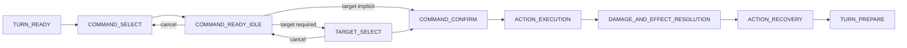
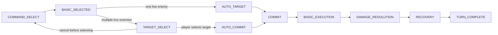
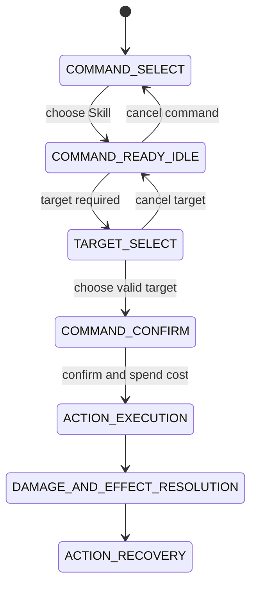
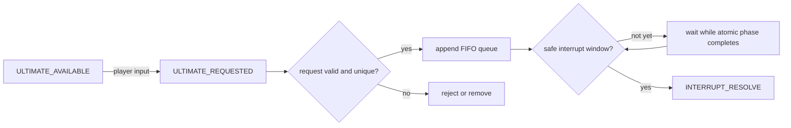
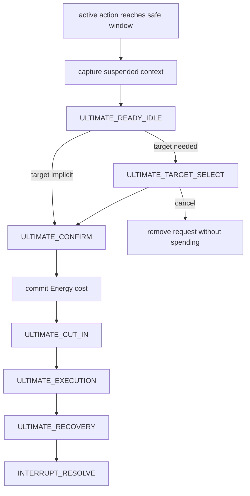
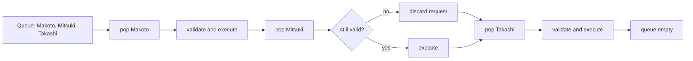
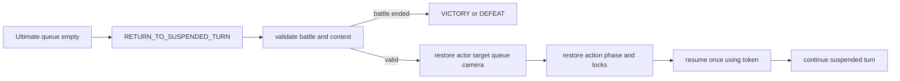

# Destiny Realms Battle System Specification

## Scope

This document defines the target battle contract. Block 5 implements the normal
turn command slice in an isolated debug scene without refactoring
`battle_manager.gd`, altering damage, changing enemy AI, rebalancing turns, or
implementing the Ultimate interrupt queue. Block 6 migrates only production
Basic Attack to that command contract behind a feature flag. Block 7 migrates
production Skill to the same contract behind its own feature flag while keeping
Ultimate legacy. Block 8 migrates production on-turn Ultimate to the same
command contract behind its own feature flag. Block 8.5 revises production
Basic Attack to a fast command with no ready idle and no confirm/cancel step,
while Skill and Ultimate keep their ready idle and confirm/cancel steps. Off-
turn Ultimate interrupt, the FIFO queue, and suspended battle context remain
unimplemented.

## Block 5 implementation status

Implemented in `scenes/battle/debug/battle_command_flow_debug.tscn`:

- Pending Basic, Skill, and turn-owned Ultimate commands.
- Ready idle, target selection, confirm/cancel, execution, resolution, recovery,
  victory, and defeat states.
- Final actor, target, and resource validation at the commit boundary.
- Single-use commit tokens guarding resource and effect resolution.
- Explicit rejection of off-turn interrupt requests until a later block.
- F6 debug controls for target cycling, Energy fill, and target invalidation.

## Block 6 implementation status

> Superseded by Block 8.5 for Basic Attack's player-facing UX: Basic no
> longer has a ready idle or confirm/cancel step. The pending-command
> architecture, adapter, feature flag, and legacy fallback described below
> are still accurate; only the ready-idle/confirm-panel behavior changed.
> See "Block 8.5 implementation status" below for the current flow.

Implemented in production `BattleManager` for Basic Attack only:

- Runtime `BasicAttackCommandAdapter` composes `BattleCommandFlow` without
  rewriting `battle_manager.gd`.
- `use_new_basic_command_flow` enables the new Basic path by default; disabling
  it restores the legacy immediate Basic fallback.
- Pressing Basic creates a pending `BASIC_ATTACK`, enters Takashi Basic ready
  idle, preselects a live enemy target, shows target highlight and production
  confirm/cancel UI, and does not deal damage or grant SP.
- Cancel clears pending command, target highlight, and confirm/cancel UI,
  restores battle idle, keeps player turn ownership, and produces no VFX, SFX,
  damage, SP, Energy, enemy turn, or camera action.
- Confirm validates battle state, actor, live target, active action token, and
  targetability before commit. Basic has no cost, so no resource mutation occurs
  at commit.
- Existing Basic execution remains authoritative for movement, animation, VFX,
  SFX, damage, hit feedback, camera shake, Energy gain, SP reward, recovery,
  victory, enemy turn, return scene, and `WorldProgress`.
- Commit token, command lifecycle flags, and production recovery/turn token
  dictionaries guard duplicate confirm, execution, resolution, recovery, and
  turn completion.
- Lesser Abyss and Bandit Captain production battles are covered. Bandit has
  one live target today; target cycling is ready for future multi-enemy
  production encounters but has no alternate target in current data.
- Skill and Ultimate remain legacy. Selecting them while Basic is pending
  cancels Basic safely first, then continues the legacy command if its existing
  checks pass.

## Block 7 implementation status

Implemented in production `BattleManager` for Skill only:

- Runtime `SkillCommandAdapter` composes `BattleCommandFlow` without rewriting
  `battle_manager.gd`.
- `use_new_skill_command_flow` enables the new Skill path by default; disabling
  it restores the legacy immediate Skill fallback.
- Pressing Skill creates a pending `SKILL` command for `triangle_rift`, enters
  Takashi Skill ready idle using existing Skill frames, preselects a live enemy
  target, shows Skill target highlight and production confirm/cancel UI, and
  does not spend SP, deal damage, play impact VFX/SFX, move Takashi, progress
  the turn, or trigger enemy AI.
- Cancel clears pending Skill, target highlight, and confirm/cancel UI,
  restores battle idle, keeps player turn ownership, and produces no damage,
  status, resource mutation, camera action, or turn progression.
- Confirm validates battle state, actor, live target, active Basic/Skill token,
  targetability, action id, and current SP before commit.
- Commit spends `SKILL_POINT_COST_SKILL` exactly once. Select, ready idle,
  target selection, cancel, and failed pre-commit validation spend nothing.
- Existing Triangle Rift execution remains authoritative for cast feedback,
  movement, projectile, VFX, SFX, one `SKILL_DAMAGE` hit, hit feedback, camera
  shake, `SKILL_ENERGY` gain, recovery, victory, enemy turn, return scene, and
  `WorldProgress`.
- Triangle Rift is currently characterized as a single-target, single-hit Skill
  with no status effect. The new path records hit index `0` per command token
  so duplicate callbacks cannot resolve the same hit twice.
- Basic and Skill use separate feature flags, adapters, active tokens, panels,
  and target highlights. Selecting either command while the other is pending
  cancels the old pending command first, then starts the new one.
- Ultimate remains legacy. Selecting Ultimate while Skill is pending cancels
  Skill first, then runs the existing Ultimate path if Energy is full. Ultimate
  Energy timing is unchanged.

Still not implemented:

- Production Ultimate command flow.
- Off-turn Ultimate request, FIFO queue, suspended context, or resume.

See `docs/battle_command_flow_implementation.md` for file ownership, test
commands, screenshots, feature flag, fallback, and known limitations.

## Block 8 implementation status

Implemented in production `BattleManager` for on-turn Ultimate only:

- Runtime `UltimateCommandAdapter` composes its own `BattleCommandFlow`
  instance without rewriting `battle_manager.gd`, mirroring the Basic and
  Skill adapters.
- `use_new_ultimate_command_flow` enables the new Ultimate path by default;
  disabling it restores the legacy immediate Ultimate fallback, including the
  old timing where Energy is zeroed the instant the button is pressed.
- Pressing Ultimate creates a pending `ULTIMATE` command for
  `octagram_fragment` with `SINGLE_ENEMY` targeting and an Energy cost of
  `MAX_ULTIMATE_ENERGY`, shows the existing Ultimate pose (`UltiTaka.png`) as a
  ready idle, preselects a live enemy target, shows Ultimate target highlight
  and production confirm/cancel UI, and does not spend Energy, start the
  cut-in, run camera cinematics, deal damage, or progress the turn.
- Cancel clears pending Ultimate, target highlight, and confirm/cancel UI,
  restores battle idle, keeps player turn ownership, and produces no cut-in,
  camera change, damage, status, resource mutation, or turn progression.
- Confirm validates battle state, actor, live target, active
  Basic/Skill/Ultimate token, targetability, action id, and current Energy
  before commit.
- Commit spends `MAX_ULTIMATE_ENERGY` Energy exactly once, fixing the legacy
  bug where Energy was zeroed synchronously on button press before any
  cut-in, camera, or animation had started. Select, ready idle, target
  selection, cancel, and failed pre-commit validation spend nothing.
- Existing Octagram Fragment execution remains authoritative for cut-in
  frame playback, camera zoom/shake, Takashi pre/post animation, VFX, SFX,
  one `ULTIMATE_DAMAGE` hit, hit feedback, recovery, victory, enemy turn,
  return scene, and `WorldProgress`. The shared execution function now takes
  an optional command so the same legacy sequence serves both the legacy
  fallback (`command == null`) and the new pending-command path.
- `PendingBattleCommand.RequestSource.INTERRUPT_REQUEST` is rejected by the
  shared `BattleCommandFlow.begin_command()` with
  `off_turn_interrupt_not_available` for all three command types, including
  Ultimate. No FIFO queue or suspended battle context is implemented; the
  adapter accepts a `request_source` parameter so Block 9 can add an
  off-turn caller without changing the command model.
- Octagram Fragment is currently characterized as a single-target,
  single-hit Ultimate with no status effect. The new path records hit index
  `0` per command token so duplicate callbacks cannot resolve the same hit
  twice.
- Basic, Skill, and Ultimate each use separate feature flags, adapters,
  active tokens, panels, and target highlights. Selecting any command while
  another is pending cancels the old pending command first, then starts the
  new one.

Still not implemented:

- Off-turn Ultimate request, FIFO queue, suspended context, or resume.

See `docs/battle_command_flow_implementation.md` for file ownership, test
commands, screenshots, feature flag, fallback, and known limitations.

## Block 8.5 implementation status

Revises production Basic Attack to a fast command. Skill and Ultimate are
unchanged: both still use ready idle, target selection, confirm/cancel,
commit, and (for Ultimate) cut-in.

`BattleCommandFlow.begin_command()` gained three optional parameters —
`requires_ready_idle`, `requires_confirm`, and `auto_commit_on_target_selected`
(all default `true`/`true`/`false`, preserving prior behavior for any caller
that does not pass them) — stored on the `PendingBattleCommand` instance
itself so the rest of the flow controller can read a single command's own
pacing rules instead of branching on command type. `BasicAttackCommandAdapter`
is the only caller that opts in to `requires_ready_idle = false`,
`requires_confirm = false`, `auto_commit_on_target_selected = true`; Skill and
Ultimate adapters pass no extra arguments and keep the original ready
idle/confirm contract.

New Basic Attack flow:

- One live enemy: `COMMAND_SELECT -> BASIC_SELECTED -> AUTO_TARGET -> COMMIT -> BASIC_EXECUTION -> DAMAGE_RESOLUTION -> RECOVERY -> TURN_COMPLETE`.
- Multiple live enemies: `COMMAND_SELECT -> BASIC_SELECTED -> TARGET_SELECT -> PLAYER_SELECT_TARGET -> AUTO_COMMIT -> BASIC_EXECUTION -> DAMAGE_RESOLUTION -> RECOVERY -> TURN_COMPLETE`.

Behavior:

- Pressing Basic with one live enemy target auto-selects it and commits in
  the same call, with no ready idle, no confirm panel, and no wait — the
  attack is already executing by the time the button-press handler returns.
- Pressing Basic with two or more live enemies enters target selection (no
  ready idle) and shows a target highlight; selecting a target — by click,
  keyboard cycle, or the shared confirm/interact key — commits immediately
  with no separate confirm panel.
- Cancel is only available before a target is chosen (multi-enemy target
  selection). A committed Basic command — which for a single live enemy
  happens instantly — cannot be cancelled or replaced.
- Command switching is unchanged in rule (selecting any command while another
  is pending cancels the old pending command first) but Basic's pending
  window is usually too short to observe with a single live enemy; the
  window is only meaningfully observable during multi-enemy target
  selection.
- Commit boundary, resource validation (actor/target liveness, battle state,
  token, no concurrent execution), duplicate-commit/execution/resolution/
  recovery/turn-completion guards, damage formula, and SP gain timing (after
  hit resolves, exactly once) are all unchanged from Block 6/8.
- Existing Basic execution remains authoritative for movement, animation,
  VFX, SFX, damage, hit feedback, camera shake, Energy gain, SP reward,
  recovery, victory, enemy turn, return scene, and `WorldProgress`.
- `use_new_basic_command_flow = false` still restores the pre-Block-6 legacy
  immediate Basic fallback, unchanged.

Removed from `battle_manager.gd`: the Basic ready-idle texture switch
(`_start_basic_ready_idle`), the Basic confirm/cancel panel and its
construction/style/visibility/update functions, and their four associated
`Control` node variables. `basic_target_highlight` and the Basic target
cycle/click selection helpers are unchanged and now double as the multi-enemy
target-selection UI.

Still not implemented:

- Off-turn Ultimate request, FIFO queue, suspended context, or resume.
- A production encounter with two or more live enemies (Basic's multi-target
  path is covered by adapter-level logic and a test-only mock second enemy,
  not by live encounter data).

See `docs/battle_command_flow_implementation.md` for file ownership, test
commands, screenshots, feature flag, fallback, and known limitations.

## Block 9A implementation status

Ultimate off-turn interrupt **architecture and characterization only**.
Off-turn Ultimate is still not executable in production after this block.
`begin_command()` still rejects `RequestSource.INTERRUPT_REQUEST`
unconditionally, exactly as it has since Block 5. Basic, Skill, and Ultimate
on-turn are unchanged.

This section is the authoritative record of the Block 9A design. The older
"Off-turn Ultimate request", "Safe interrupt window", "Interrupt and
Ultimate execution", "Multiple Ultimate queue", "Suspended battle context",
and "Resume suspended turn" sections below predate this block (Block 5) and
are kept as the original conceptual sketch; where this section's field
names or rules differ, this section wins.

### Final design intent

Ultimate may be **requested** off-turn when: Energy is sufficient, the
character is alive, the Ultimate action is available, the battle has not
reached victory/defeat, no other Ultimate is currently active, the current
state accepts requests, and the requesting actor has no other pending
interrupt request. A request never runs immediately — it is appended to a
FIFO queue and does nothing else.

When the battle reaches a safe interrupt window, the queue is drained one
request at a time:
1. Revalidate the request (actor, Energy, battle state).
2. Suspend the current battle context at that safe point.
3. Run the queued Ultimate through the **same** on-turn flow already built in
   Block 8: `ULTIMATE_READY_IDLE -> TARGET_SELECT -> CONFIRM/CANCEL ->
   ENERGY_REVALIDATION -> COMMIT/SPEND_ENERGY -> ULTIMATE_CUT_IN ->
   ULTIMATE_EXECUTION -> DAMAGE_AND_EFFECT_RESOLUTION -> ULTIMATE_RECOVERY`.
4. Process the next queued request if one exists, otherwise resume the
   suspended context from its exact safe point.

Hard rules (unchanged by any future block without a fresh review):
- An Ultimate may never interrupt another Ultimate.
- An interrupt may never begin while a commit/damage resolution is already
  in flight for any command.
- Damage, turn completion, and victory/defeat resolution each still happen
  exactly once per command, the same guarantee Basic/Skill/Ultimate on-turn
  already have via commit tokens.
- An already-committed enemy action is never discarded or replayed.
- Turn order is never reordered by an interrupt; only *paused and resumed*.
- Energy is deducted **only** at Ultimate commit — never at request time,
  never while queued, never entering ready idle, never on cancel. This is
  the same rule Block 8 already enforces for on-turn Ultimate; off-turn must
  not weaken it.

### Current battle characterization (Block 9A audit)

**Player turn.** `state == PLAYER_TURN` is entered by `_begin_player_turn()`
(`battle_manager.gd`). Basic, Skill, and Ultimate each go through their own
`BattleCommandFlow` instance via their adapter (Block 6/7/8). Command
switching already guarantees at most one pending command and at most one
committed command across all three at any time (existing guards in
`_on_attack_pressed`/`_on_skill_pressed`/`_on_ultimate_pressed`, unchanged by
this block).

**Enemy turn — no commit token, no guard chain.** This is the most important
finding of this audit. Unlike Basic/Skill/Ultimate, the enemy attack is
*not* modeled through `PendingBattleCommand`/`BattleCommandFlow` at all; it
is a single ad hoc coroutine with almost none of the token/guard
infrastructure the player commands have:
- `_begin_enemy_turn()` sets `state = ENEMY_TURN`, disables input, and
  `await`s `TURN_DELAY_SECONDS` (0.6s). This wait is checked once
  (`if state == ENEMY_TURN: _enemy_attack()`) — this is the only place in
  the entire enemy turn where a state change is checked before proceeding.
- `_enemy_attack()` computes damage and log text up front (no commit
  boundary), then `await`s `enemy.play_attack_movement(player)`, with
  exactly one guard check after that single await
  (`if state != ENEMY_TURN: return`).
- Everything after that guard — SFX, VFX, `player.take_damage(damage)`,
  floating damage, `await player.play_hit_feedback()`, `_shake_camera()`,
  the `player.is_defeated()` check, and the call into `_lose()` or
  `_begin_player_turn()` — runs with **zero** further guard checks, including
  after the `play_hit_feedback()` await. Basic/Skill/Ultimate all re-check a
  guard after every `await`; the enemy turn does not.
- Practical consequence for Block 9B+: the entire enemy attack, from the
  start of `play_attack_movement` through `_begin_player_turn()`/`_lose()`
  returning, must be treated as **one unsafe window**. There is no
  sub-window inside it a future interrupt could safely target without first
  adding the same guard discipline Basic/Skill/Ultimate already have — that
  guard work is out of scope for Block 9A (it would change enemy-turn
  behavior, which is forbidden this block) and is called out as a Block 9B
  prerequisite below.

**Ultimate on-turn cut-in chain.** `_run_ultimate_sequence()`
(`scripts/battle/battle_manager.gd`) is ~88 lines and 11 guard checkpoints
(`_ultimate_execution_guard()`), covering: camera zoom-in, FVX intro, pre
animation, the 88-frame full-screen cut-in, shatter/SFX, post animation,
camera zoom-out, player feedback, player movement, enemy impact VFX, damage,
hit feedback, glow fade-out, impact camera zoom-out. Every `await` boundary
is followed by a guard re-check exactly as Block 8 documented. This entire
function, start to finish, is an unsafe window — see below.

**Victory/defeat.** `_win()`/`_lose()` already zero all three active command
tokens and call `lock_for_outcome()` on all three adapters unconditionally.
This means Block 9B's suspended-context discard-on-victory/defeat rule has
an existing hook to attach to: any live `SuspendedBattleContext` at the
moment `_win()`/`_lose()` runs must be discarded there, since these
functions already assume nothing else is still commit-active afterward.

**Resource leak note.** Every test run in this session (Basic, Skill,
Ultimate, debug scene, Bandit startup) prints `WARNING: 2 ObjectDB instances
were leaked at exit` / `ERROR: 1 resources still in use at exit` at
`get_tree().quit()`. This is a pre-existing condition already documented in
the Block 8 verification notes, reproduces identically with zero Block 9A
code loaded, and is unrelated to interrupt work. Not investigated further
per this block's scope (no behavior changes).

### Safe interrupt windows

| Window | Where in current code | Verdict |
| --- | --- | --- |
| A. Before enemy action commit | The `await get_tree().create_timer(TURN_DELAY_SECONDS).timeout` inside `_begin_enemy_turn()`, before `_enemy_attack()` is called | Safe in principle, but there is no hook today to redirect from this await into interrupt processing — adding one is Block 9B work, not Block 9A |
| B. After enemy action recovery, before next turn | The instant between `_enemy_attack()` calling `_begin_player_turn()`/`_lose()` and that function returning, before any input is processed | Safe — matches `COMMAND_SELECT`-equivalent state with no pending/committed command on any of the three adapters |
| C. Player `COMMAND_SELECT`, no pending command | `state == PLAYER_TURN` and `_has_pending_basic_command() == false` and `_has_pending_skill_command() == false` and `_has_pending_ultimate_command() == false` | Safe — this is the same condition `begin_command()` already requires (`battle_state == COMMAND_SELECT`) |

Unsafe windows (current code, confirmed by this audit):
- Any point inside `_enemy_attack()`'s await chain (movement through
  `_begin_player_turn()`/`_lose()` return) — see characterization above.
- Any point inside `_run_ultimate_sequence()` (cut-in, execution, recovery).
- Any point between a Basic/Skill/Ultimate command's `commit_pending_command()`
  returning `true` and its `complete_recovery()` returning `true` — i.e.
  while `active_basic_command_token`/`active_skill_command_token`/
  `active_ultimate_command_token` is non-zero.
- During `_win()`/`_lose()` and the following scene-transition await.
- During scene exit/teardown (`_exit_tree()`).

For Block 9A, `BattleCommandFlow.can_process_interrupt_now()` exists as a
named stub (always returns `false`) rather than a real implementation,
because the real answer needs `BattleManager`-level state (whose turn it is,
whether the enemy await chain is mid-flight) that `BattleCommandFlow` — a
per-command, not per-battle, controller — does not have. See "BattleCommandFlow
impact" below.

### Suspended battle context

Implemented as a skeleton class,
`scripts/battle/command/suspended_battle_context.gd`
(`class_name SuspendedBattleContext`, `extends RefCounted`). Field names
differ slightly from the original Block 5 sketch further down this document
to match what a safe window in *this* codebase actually needs to capture:

| Field | Notes |
| --- | --- |
| `suspended_state` | Snapshot of `BattleManager.state` at suspension |
| `current_turn_owner` | `&"player"` or `&"enemy"` |
| `current_actor`, `current_target` | Node references at suspension |
| `current_action_id`, `current_action_phase` | Identifies what was interrupted |
| `current_commit_token`, `current_turn_token` | For duplicate-resume detection |
| `pending_effect_status` | Renamed from the original sketch's `pending_effects: Array`; a status tag, not a live effect list, since live effects must never be replayed |
| `active_ui_state`, `input_lock_state`, `target_highlight_state` | UI restoration data |
| `camera_state` | Renamed from the original sketch's untyped dictionary; still a `Dictionary` (deliberately not live `Tween`/`Camera2D` references) |
| `enemy_action_context` | Only populated if interrupt occurs mid-enemy-turn |
| `resume_policy`, `resume_token` | `resume_token` is single-use, enforced by `mark_resumed()` |

Behavior implemented and unit-testable today: `mark_resumed()` returns
`true` exactly once and `false` on every call after (including after
`discard()`); `discard()` is permanent; `can_resume()` reflects both flags.
**Not implemented:** nothing constructs, populates, or resumes a
`SuspendedBattleContext` from live battle state yet — that requires
`BattleManager` integration, which is Block 9B+.

### Interrupt request and queue model

Implemented as two skeleton classes:

- `scripts/battle/command/ultimate_interrupt_request.gd`
  (`class_name UltimateInterruptRequest`, `extends RefCounted`) — plain data
  holder: `unique_request_id`, `actor`, `actor_id`, `action_id`,
  `request_source` (defaults to `RequestSource.INTERRUPT_REQUEST`),
  `energy_cost`, `requested_at_state`, `requested_at_turn`, `request_order`,
  `preferred_target`, `validation_status`
  (`PENDING`/`ACCEPTED`/`REJECTED`/`EXPIRED`), `reject_reason`,
  `created_at_msec`. Constructing one has no side effects on Energy, HP, or
  turn state.
- `scripts/battle/command/ultimate_interrupt_queue.gd`
  (`class_name UltimateInterruptQueue`, `extends RefCounted`) — pure FIFO
  queue. `configure(energy_lookup, battle_over_lookup,
  ultimate_active_lookup)` takes three `Callable`s so the queue never reads
  `BattleManager` directly, mirroring how `BattleCommandFlow` takes resource
  callbacks via `configure_resource_callbacks()` instead of reaching into
  `BattleManager`. `request_ultimate()` validates and either enqueues or
  rejects synchronously; `peek_next()`/`dequeue_next()` preserve FIFO order;
  `cancel_request_for(actor)` removes a still-queued request;
  `revalidate(request)` is the process-time recheck hook for Block 9B.

**Not wired to production**: nothing in `battle_manager.gd` creates a
`UltimateInterruptQueue` instance. The class is exercised only by
`tests/battle/test_ultimate_interrupt_queue.gd`.

### Validation layers

**Request-time** (`UltimateInterruptQueue.request_ultimate()`, implemented):
actor valid and alive, not a duplicate for that actor, battle not already
over, no Ultimate currently active, Energy sufficient for the quoted cost.
Rejection never enqueues and never touches Energy.

**Process-time** (`UltimateInterruptQueue.revalidate()`, implemented as a
callable hook, not called by anything yet): the same checks re-run
immediately before a dequeued request would be acted on, since time has
passed since the original request (actor may have died, Energy may have
changed, another Ultimate may have started). A future caller is expected to
treat a non-empty reason as "drop and continue to the next queued request,"
mirroring how a dead/invalid target already cancels a Basic/Skill/Ultimate
command safely today.

**Commit-time** (already implemented in Block 8, unchanged): identical to
on-turn Ultimate — `commit_pending_command()`'s existing validation
(actor/target/resources), single commit token, Energy deducted exactly
once. Block 9B's job is only to route a validated off-turn request into this
existing path, not to build a second commit boundary.

### BattleCommandFlow impact

Three additive stub methods were added to
`scripts/battle/command/battle_command_flow.gd`, each documented inline as
always returning `false` in Block 9A and calling out why:
`can_process_interrupt_now()`, `queue_ultimate_interrupt(request)`,
`begin_interrupt_request(actor, action_id, target_rule, candidate_targets,
energy_cost)`. None of them are called by any other method in the file or
by any production code. `begin_command()` is unmodified and still contains
the original unconditional `if request_source ==
RequestSource.INTERRUPT_REQUEST: _fail(...); return false` check as its
first line.

No enum values were added to `BattleFlowState`/`CharacterAnimationState`/
`UiInteractionState`. This was a deliberate choice, not an oversight:
`BattleCommandFlow` models one pending command for one actor, while
"suspended battle" is a battle-wide concept spanning whichever command was
active plus the enemy turn, which this controller has no representation of.
Adding a `SUSPENDED` value to `BattleFlowState` would conflate two different
scopes. That state, if needed, belongs on `SuspendedBattleContext` or
`BattleManager`, decided in Block 9B once the real integration shape is
known.

### UI readiness spec (design only, no production UI added)

For Block 9B/9C, the following UI affordances are anticipated but **not**
implemented in Block 9A:
- An "Ultimate Ready" indicator whenever Energy is full, even off-turn
  (distinct from the existing on-turn action button state).
- An off-turn request input (button or shortcut) that only appears when the
  request-time validation above would pass.
- A small "Ultimate queued" toast/indicator while a request is accepted but
  not yet processed.
- "Cannot interrupt now" feedback when a request is rejected (reusing the
  existing `_basic_command_failure_message`/`_skill_command_failure_message`/
  `_ultimate_command_failure_message` pattern already established per
  command type).
- When the safe window is reached and the queued request is dequeued, the
  UX is identical to on-turn Ultimate: ready idle, target selection,
  confirm/cancel, cut-in — no new screens.

No Skill/Ultimate panel, no Basic UI, and no shared battle UI were touched
in Block 9A.

### Test plan and Block 9 status

Implemented now: `tests/battle/test_ultimate_interrupt_queue.gd` (+
`.tscn`), a pure contract test against `UltimateInterruptQueue` in
isolation (no `BattleManager`, no scene). Covers: valid request enqueues,
duplicate actor rejected, insufficient Energy rejected, dead actor
rejected, battle-already-over rejected, Ultimate-already-active rejected,
FIFO order, Energy never spent by enqueue, cancel clears the queue,
`revalidate()` catches a request that went stale after enqueue.

Deferred to Block 9B+ (not built in Block 9A): any test that exercises
`BattleManager` actually creating a queue, suspending context, or draining
requests into the existing Ultimate commit path — because none of that
exists yet.

### Known risks carried into Block 9B

1. Enemy turn has no guard-chain discipline at all (see characterization
   above); Block 9B likely needs to add guard checks to `_enemy_attack()`
   itself before any interrupt window inside it can be considered, and that
   is a change to enemy-turn code that must be scoped and reviewed
   separately from "wire the queue up."
2. `_run_ultimate_sequence()`'s 11-checkpoint guard chain was designed
   around a single command's own token, not around "was a *different*
   actor's off-turn Ultimate spliced in here" — Block 9B needs to decide
   whether the suspended-context resume path re-enters this same function
   or a variant of it.
3. Camera state (`battle_camera.position`/`zoom`/`offset`) is currently
   restored by direct tween calls scattered through
   `_run_ultimate_sequence()`, not captured as data anywhere. A
   `SuspendedBattleContext.camera_state` snapshot/restore pair needs a real
   implementation before resume can be trusted.
4. `MAX_ULTIMATE_ENERGY`/`ULTIMATE_DAMAGE` and all other balance constants
   are unaffected by this block, but multi-actor off-turn Ultimate implies
   more than one character can reach full Energy independently — this
   block does not audit whether `ultimate_energy` is actor-scoped or
   `BattleManager`-scoped in the current code (it is currently a single
   `BattleManager`-level variable; only Takashi has an Ultimate today, so
   this has not mattered yet, but Block 9B must confirm before a second
   Ultimate-capable actor is added).

## Responsibility model

Four independent state domains are required:

| Domain | Owns | Must not own |
| --- | --- | --- |
| Battle flow | Turn and command phase transitions | Sprite frame timing |
| Character animation | Battle idle, ready idle, action, hit, recovery | Damage or resource mutation |
| UI interaction | Visible controls, focus, target cursor, confirm/cancel, locks | Battle outcome |
| Action resolution | Costs, damage, healing, status, pending effects | Input focus or camera composition |

An animation completion signal may permit a battle transition, but animation
code must not directly decide damage or advance the turn.

## Normal command flow

Skill and Ultimate use the full ready-idle/confirm commit boundary. Basic
Attack (as of Block 8.5) shares the same underlying commit boundary and
validation but skips `COMMAND_READY_IDLE` and `COMMAND_CONFIRM`:



Rules:

- A command button creates a pending action; it does not deal damage before
  its commit boundary, even when that boundary is reached in the same call
  (Basic Attack with a single live enemy).
- Costs are validated while selecting but committed only after confirmation
  (Skill, Ultimate) or immediately at auto-commit (Basic Attack).
- Input is locked during execution, effect resolution, and unsafe recovery.
- Damage and status events run once from a committed action.
- Recovery returns the actor to battle idle before the next turn begins.

## Basic Attack fast flow

Basic Attack skips `COMMAND_READY_IDLE` and `COMMAND_CONFIRM` entirely. A
single live enemy is auto-targeted and auto-committed in the same step;
multiple live enemies require a target choice, which itself commits:



Once `COMMIT` is reached, Basic Attack follows the same commit-token,
duplicate-prevention, and authoritative-execution rules as Skill and
Ultimate; only the pre-commit UX (no ready idle, no confirm panel) differs.

## Skill ready idle

Applies to Skill and Ultimate. Basic Attack does not use this diagram; see
"Basic Attack fast flow" above.



`COMMAND_READY_IDLE` owns presentation of the selected Skill pose. The pending
action owns actor, command, candidate target, and quoted cost. Cancel destroys
that pending action, restores normal battle idle, and spends nothing.

## Target selection

- Target rules belong to action data or a target policy, not individual buttons.
- Valid targets are recalculated before confirmation.
- A single valid target may be preselected but still follows the confirmation
  contract unless the command explicitly opts into immediate confirmation.
- Cancel from target selection returns to ready idle.
- If all targets become invalid, return to command selection with no cost.

## Ultimate Energy

- Energy is battle-only and has one battle-owned source of truth per character.
- Gain events are explicit action-resolution events.
- Availability is `current_energy >= ultimate_cost`.
- Pressing Ultimate creates a request or pending action; it does not spend.
- Confirmation atomically validates actor, target, and cost, then deducts.
- Cancel before confirmation does not spend Energy.
- UI observes Energy and availability; it does not calculate or mutate them.
- Victory, defeat, and battle teardown invalidate pending Ultimate requests.

## Off-turn Ultimate request

> Block 9A note: the FIFO queue this diagram describes is now implemented
> as `UltimateInterruptQueue` (skeleton, not wired to production). See
> "Block 9A implementation status" above for the actual field names, reject
> reasons, and validation rules — this diagram's shape is still accurate,
> but that section is authoritative where they differ.



Allowed input states must be listed explicitly. At minimum, requests may be
accepted during normal player and enemy turn activity, except while input is
locked, an Ultimate is active, battle is ending, or the scene is paused.

## Safe interrupt window

> Block 9A note: "Safe interrupt windows" above maps these general
> categories onto the actual current code (which windows exist today, which
> don't yet have a hook, and why enemy turn is entirely unsafe today). That
> section is authoritative for this codebase; this section states the
> general principle.

A safe interrupt window exists only between atomic action phases. It is not a
timer and must not be inferred from a visual frame number.

Safe examples:

- Before an action starts.
- After movement/cast setup completes but before the committed hit phase, if the
  action contract marks that boundary resumable.
- After all damage and effects for the current atomic phase have resolved.
- During stable turn preparation or recovery.

Unsafe examples:

- While damage, heal, status, or resource events are being applied.
- During a hit loop that has not committed all of its hits.
- While a camera or animation await is expected to trigger the next effect.
- During an Ultimate cut-in, execution, or recovery.
- During victory/defeat transition.

## Interrupt and Ultimate execution



No Ultimate may interrupt another Ultimate. New valid requests may be appended
while the queue is open only if the active state permits input; they wait until
the current Ultimate recovery completes.

## Multiple Ultimate queue



Queue rules:

- FIFO order.
- At most one pending request per character.
- Queue membership is independent from turn ownership.
- Validate again immediately before ready idle and before commit.
- Dead, disabled, removed, unaffordable, or targetless requests are discarded
  safely.
- A cancelled request may be requested again later if availability remains.

## Suspended battle context

> Block 9A note: this class is now implemented at
> `scripts/battle/command/suspended_battle_context.gd` with field names
> adjusted for what this codebase's safe windows actually need to capture
> (see "Block 9A implementation status" above for the field table and the
> reasoning). The sketch below is the original Block 5 proposal; the
> implemented skeleton is authoritative where names differ.

Recommended data contract (original Block 5 sketch):

```gdscript
class_name SuspendedBattleContext

var actor_id: StringName
var target_ids: Array[StringName]
var turn_index: int
var battle_state: int
var action_id: StringName
var action_phase: int
var pending_effects: Array
var turn_queue: Array[StringName]
var input_lock: bool
var camera_state: Dictionary
var animation_completion: Dictionary
var active_status_resolution: Dictionary
var resume_token: int
```

The snapshot stores identifiers and deterministic phase data, not live Tween or
Signal objects. `resume_token` guards against duplicate resume. A first
prototype may support only explicitly resumable phase boundaries.

## Resume suspended turn



Resume must never replay an already committed damage/effect event. If the
suspended actor or target is no longer valid, the action resolves through a
documented cancellation/recovery path rather than restarting the turn.

## Official battle states

| State | Responsibility |
| --- | --- |
| `BATTLE_START` | Encounter setup, presentation, and initial validation |
| `TURN_PREPARE` | Choose actor, process start-of-turn effects |
| `TURN_READY` | Stable actor turn before command input |
| `COMMAND_SELECT` | Basic/Skill/Ultimate command navigation |
| `COMMAND_READY_IDLE` | Selected Basic/Skill pose and pending action |
| `TARGET_SELECT` | Validate and choose normal-action target |
| `COMMAND_CONFIRM` | Final validation and atomic cost commit |
| `ACTION_EXECUTION` | Movement, cast, and action animation |
| `DAMAGE_AND_EFFECT_RESOLUTION` | Apply committed damage/status exactly once |
| `ACTION_RECOVERY` | Restore stage, actor idle, and post-action state |
| `ULTIMATE_AVAILABLE` | Availability flag/event, not a blocking phase |
| `ULTIMATE_REQUESTED` | Accepted request awaiting queue processing |
| `ULTIMATE_READY_IDLE` | Ultimate-specific pending pose |
| `ULTIMATE_TARGET_SELECT` | Validate and choose Ultimate target |
| `ULTIMATE_CONFIRM` | Final target/cost validation and Energy commit |
| `ULTIMATE_CUT_IN` | Exclusive cinematic setup; no nested interrupt |
| `ULTIMATE_EXECUTION` | Ultimate animation and committed action |
| `ULTIMATE_RECOVERY` | Restore camera/stage and close active Ultimate |
| `INTERRUPT_RESOLVE` | Validate queue and choose execute-or-resume |
| `RETURN_TO_SUSPENDED_TURN` | Restore one suspended context exactly once |
| `VICTORY` | Lock requests/input and finalize encounter success |
| `DEFEAT` | Lock requests/input and expose retry/exit behavior |
| `PAUSED` | Pause presentation/input without mutating action state |

`ULTIMATE_AVAILABLE` is best represented as availability data or an event
alongside the current flow state. It must not replace the active turn state.

## Victory and defeat

- Check outcome after each committed damage/effect batch.
- If an Ultimate ends battle, clear the remaining request queue.
- Do not restore a suspended turn after outcome is final.
- Victory/defeat owns input lock and scene transition.
- Encounter-specific completion remains delegated to the current stable flow.

## Existing implementation audit

Audited files:

- `scripts/battle/battle_manager.gd` (2,067 lines)
- `scripts/battle/battle_ui.gd` (367 lines)
- `scripts/battle/combatant.gd` (134 lines)
- `scripts/battle/timing_bar.gd` (78 lines)
- `scripts/battle/battle_sfx.gd` (824 lines)
- `scenes/battle/battle_scene.tscn`

Findings:

| Area | Current behavior | Gap against target |
| --- | --- | --- |
| Flow state | Five states: player, resolution, enemy, win, lose | Command, target, recovery, and interrupt phases are collapsed |
| Basic | Production path uses pending command, commit token, and auto-commit (no ready idle/confirm by design, Block 8.5); legacy fallback still enters resolution immediately | Multi-enemy target-select path has no live production encounter to exercise it |
| Skill | Production path now uses pending/confirm/commit; legacy fallback still spends SP before cast feedback | Later multi-skill data still needs the same boundary |
| Ultimate | Production on-turn path now uses pending/confirm/commit; legacy fallback still zeroes Energy on press | No off-turn request, queue, or safe interrupt |
| Confirm | Confirm during player turn calls Basic Attack | It is a shortcut, not command confirmation |
| Targeting | Player actions use the single `enemy` node directly | No independent target-selection state or policy |
| Energy | `battle_manager.gd::ultimate_energy` is current source | Single-character and manager-local; no per-character model |
| Turn order | Alternates player/enemy and displays static chips | No resumable queue or turn context snapshot |
| Idle | Battle idle plus Basic/Skill/Ultimate frame sets exist | Command-specific frames immediately accompany execution |
| Timing bar | Standalone API exists but is not connected to manager flow | Dormant system; do not build interrupt on it |
| Encounter flow | One scene configures Lesser Abyss or Bandit Captain | Stable and must remain unchanged in Block 4 |
| UI | HP, Energy, SP, turn chips, and three command buttons exist | UI and flow are tightly coupled to manager signals |
| Sequencing | Await chains guard `ACTION_RESOLUTION` repeatedly | Mid-chain suspension risks skipped or duplicated effects |
| Structure | Manager mixes encounter config, flow, assets, VFX, camera, audio | Monolithic; interrupt additions would increase coupling |

The Lesser Abyss default routes victory to Ending and retry to Prologue. The
Bandit Captain variant reads `WorldProgress.active_battle_id`, swaps enemy,
background and BGM, completes the encounter on victory, and returns to
Grasslands. These flows were audited but not modified.

## Main risks

1. Resuming an await chain after mutation can duplicate damage or skip recovery.
2. Immediate resource mutation conflicts with cancel and request validation.
3. A single integer state cannot describe flow, animation, UI, and resolution.
4. Direct actor/enemy references prevent party and multi-target expansion.
5. Camera/UI restoration is currently embedded in Ultimate execution.
6. Async callbacks can survive a state change unless guarded by action tokens.
7. Static turn chips do not represent an authoritative queue.

## Recommended implementation phases

1. Add characterization tests around existing Basic, Skill, Ultimate, Lesser
   Abyss, and Bandit Captain behavior.
2. Introduce data-only `BattleAction`, `ActionPhase`, and per-character battle
   resource models without changing results.
3. Add a small flow controller for command select, ready idle, target, confirm,
   cancel, execution, resolution, and recovery.
4. Move current visual sequences behind action-executor interfaces while
   retaining their timing and damage values.
5. Introduce authoritative turn queue and resumable action tokens.
6. Prototype one off-turn Ultimate at explicit safe boundaries.
7. Add FIFO, duplicate prevention, invalidation, and multi-Ultimate tests.
8. Integrate battle UI availability and target feedback only after the state
   contract is stable.

Recommended extraction boundaries are `BattleFlowController`,
`BattleActionResolver`, `BattleTurnQueue`, `UltimateRequestQueue`,
`BattlePresentationController`, and `EncounterConfig`. Existing VFX/audio
functions can remain behind the presentation controller until later.
